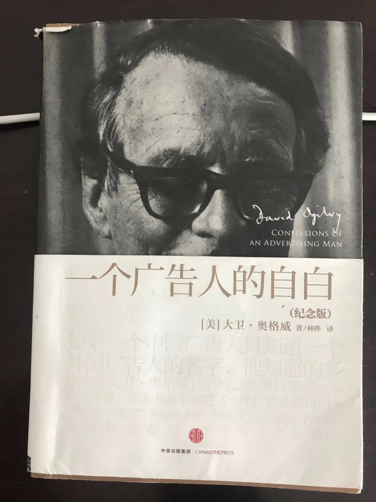

# 一个广告人的自白

## 一、怎样经营广告公司

- 我欣赏刻苦工作、能啃硬骨头的人。不喜欢上了船但却不尽本分的过客。
  - 刻苦工作包含着经济收益，努力工作的人越多，我们的盈利就越多，盈利越多，我们大家能得到的钱就越多
- 我欣赏有头脑的人。
  - 缺少头脑的人，无法把公司经营为优秀的公司
  - 头脑必须与富有理智的实诚相结合
- 我欣赏满腔热忱的人
  - 如果你不喜欢你的工作，劝你另谋高就
  - 活着就要快乐，人一死就不能寻求快乐
- 看不起对上司专营、阿谀奉承的人
  - 一般来说，正是这种人对下属镇横跋扈
- 我欣赏有自信心的专业人士
  - 他们都尊重同事们的专业技能
  - 不做欺世盗名之事
- 我敬佩愿意任用有能力、将来可以接替自己的优秀下属的人
  - 总觉得自己岌岌可危，只任用庸才得以自保的主管，很可怜
- 我尊敬那些注意培养属员的人
  - 因为这是我们唯一能从内部提拔人才的途径
  - 我讨厌从外面物色人选来担任要职
- 我钦佩工作组织严密、准时完成任务的人
  - 今日事今日毕

## 二、怎样争取客户

- 来找我做广告的客户的产品必须是令我们引以为傲的
  - 产品必须对撰稿人来说有吸引力
- 除非我们确信我们能比客户的前一家广告公司干得更出色，否则不会接受他们的聘用
  - 从客户的角度考虑
- 谢绝产品销量长期下降的客户
  - 出现销售不良，几乎总是因为产品有缺陷或是厂家管理不善
- 搞清楚客户是否希望你有利可图
  - 不能过分服务让自己破产
  - 也不能敷衍服务丧失业务
- **厂商和广告公司的关系就好比病人和医生之间的关系一样密切**
  - 接受客户之前，弄清楚，是否确实可以和他愉快相处
- 谢绝把广告看成全部营销活动中边际因素的客户
  - 我们为客户生意开刀的位置那是不可或缺的心脏
- 不接受实验室测试还未完结的新产品
  - 新产品十中有八是会夭折在试销市场中
- 千万不要揽“协会”客户
  - 婆婆太多，目标太多，钱则太少

## 三、怎样维系客户

- 你可以把最好的人才用来为现有的客户服务
- 你不要任用处事草率、很不随和的人做客户主管
- 要避免揽进那些一再辞掉自己广告公司的客户
- 你可以和你客户的每个层次的人保持联系
- 尽量站在客户的角度，以他们的眼光看问题
  - 买客户的股票，用客户的产品

## 四、怎样当一个好客户

- 100万的有效广告费用比起1000万无效广告的推销力还要大
- 消除你的广告公司的惶恐心理
  - 换广告公司前，不妨先自问以下问题
    - 新广告公司是不是能解决你的问题？
    - 是不是你的产品落后过时？
    - 是不是你指示要按你的主意创作广告？
    - 是不是你吓唬广告公司，让他们不知所措？
    - 你的广告经理是不是一个会否定广告公司最好建议的庸才？
    - 你的商业秘密被竞争对手利用，你感受如何？
    - 是否意识到更换广告公司会觉乱营销活动12个月以上？
    - 对你广告公司的头头是不是坦诚相见？如果你说出你的不满，他或许会更加努力
- 首先选对广告公司
  - 让广告经理挑选3、4家最能配合你的业务广告公司制作的有代表性的广告
  - 向这些广告公司的客户了解情况
  - 和广告公司的主管和骨干人员共进晚餐。
    - 观察他们的关系，是忠诚合作还是各怀鬼胎耍手段的人
    - 他们是不是做出明显夸大了的承诺
    - 他们是死气沉沉还是干劲十足？
    - 他们是不是善于倾听别人的意见？
    - 他们是不是真诚？
    - 你是不是喜欢他们？
  - 不要错误地以为大广告公司里，你的业务机会被忽视
    - 100万美元，9个人为你服务
- 向你的广告公司全面彻底地介绍你的情况
  - 你的广告公司对你的公司和你的产品了解的越多，他们为你做的广告就越好
- 不要在创作领域里和你的广告公司较高低
  - 何必养狗了又自己汪汪叫呢？
- 悉心照料给你下金蛋的鹅
  - 新产品的广告宣传需要额外投入
- 不要让一层又一层的机构干预你的广告宣传
  - 那些乌七八糟的广告，大多是集体确认的产物
  - **委员会集体可以对广告提意见，但是绝对不能让他们创作广告**
- 确保你的广告公司有利可图
  - 如果公司觉得为你创作广告无利可图，他们就绝对不能派第一流的人才为你服务
  - 而且迟早会找让他们赚钱的客户取代你
  - 广告公司每替客户花100美元平均利润是34美分
- 不要和你的广告公司斤斤计较
  - **产品也有出残次品的时候，创作广告也同样困难，如果广告不满意，需要主动承担重新制作的费用**
- 坦诚相见、鼓励坦率
  - 如果你认为广告公司表现很糟，或者认为某一份广告做的不够份量，千万不要绕圈子，要讲清你的想法，直言不讳
  - 和广告公司捉迷藏，后果是灾难性的
- 定出高标准
  - 要不断的鼓励广告公司攀登更高的山峰
- 一切经过测试
  - 面向消费者测试你的产品、测试你的广告，你在市场上就会事半功倍
- 急取效率
  - **把时间按月分段，以加速整个市场营销进程，按月核查广告和利润**
- 不要为有问题的产品浪费时间
  - 集中你的时间、才智以及广告费去经营你的成功产品
  - 对成功的产品应该投入更广泛的宣传
  - 舍弃失败的产品
- 珍惜良才
  - **庸人所见，无不低于自己**
  - 良才几乎毫无例外，他们都很难相处，要珍惜他们，他们才会替你下金蛋
- 勿使广告预算捉襟见肘
  - 不把钱花足好好做广告是广告宣传中最大的浪费
  - **就像买票去欧洲，只买全程2/3，花的钱不少，但是你却未能到达欧洲**
  - 如果广告经费一年不足200万美元，就不要做全国性的宣传活动，集中财力于最有把握的市场

## 五、怎样创作高水平的广告

- 什么是好广告？
  - 对什么东西都无所谓的人来说，客户认可的就是好广告
  - 不引起公众注意它自己就把产品推销掉的广告
    - **好广告要诉求的对象说的不是：“多妙的广告”，而是：“我从来没有听说过这种产品，我一定要买它来试试”**
- 广告的内容比表现内容的方法更重要
  - 真正决定消费者购买或不购买是你广告的内容，而不是他的形式
  - 选择正确的承诺极端重要，对比测试
- 若是你的广告的基础不是上乘的创意，它必遭失败
- 讲事实
  - **向消费者讲各种品牌共有的东西也是极其有价值的**
- 令人厌烦的广告是不能促使人买东西的
- 举止彬彬有礼，但不装模作样
  - 人们不会从小丑那里买东西
- 使你的广告具有现代意识
- 委员会可以批评广告，却不能写广告
- 若是你运气好，创作了一则很好的广告，就不妨重复使用，直到它的号召力减退
- 千万不要写那种你不愿意让你的家人看的广告
  - 如果你就产品说了谎，你迟早会被发现
- 形象和品牌
  - 每一则广告都应该看成是对品牌形象这种复杂的东西在做贡献
  - 绝大部分厂商不接受他们的品牌形象具有一定局限性的事实
  - 改变廉价货的老面孔，是极不容易的事
  - **致力于以广告为自己的品牌树立明确突出的个性的厂商，会在市场上获得较大的占有率和利润**

- 不要当文抄公
  - 模仿是一个品德低劣的人的标志

## 六、怎样写有效力的文案

- 标题
  - 标题代表着一则广告所花费用的80%
  - 标题用来向你潜在的买主打招呼
  - **每个标题都应该带出产品给潜在买主自身利益的承诺**
  - 始终在标题中加入新的信息
    - 标题中最有份量的两个词是“免费”和“新”
  - 其他会产生良好效果的字眼是：如何、突然、当今、宣布、引进、就在此地、最新到货、重大发现、改进、惊人、轰动一时、了不起、划时代、令人叹为观止、奇迹、魔力、奉献、快捷、简易、需求、挑战、奉劝、实情、比较、廉价、从速、最后机会等
  - 标题应该带有品牌名
  - **在标题中写进你的销售承诺**
    - 10个以上的词带有新信息比短标题更能推销商品
  - 在标题结尾，应该写点诱人继续往下读的东西
  - 标题比如以电报式文体讲清要讲的东西，文字要简洁，直截了当，不要和读者捉迷藏
  - 避免在标题中写否定词
    - 读者往往会忽略否定词
  - 避免使用有字无实的瞎标题
- 正文
  - 不要旁敲侧击，要直截了当
  - **不要用最高级形容词**
  - 如果产品有各种各样的特征，就写长文
    - 介绍的越详细，销售得越多
  - 每则广告都应该是一件推销你的产品的完整的作品
  - 应该在文案中写使用用户的经验之谈
  - **可以向读者提供有用的资讯或者服务**
    - 可以比单纯讲产品本身的文案多招来75%的读者
  - 高雅的文字对广告是明显的不利因素
  - 避免唱高调
    - 避免自吹自擂
  - 除非有特别的原因要在广告中使用严肃、庄重的词
  - 不要贪图写那种获奖文案
    - 评委不清楚广告的绩效，见解又依赖于文辞表现
  - 优秀的文案撰稿人从不会从文字娱乐读者的角度去写广告文案
    - 衡量他们成就的标准是：看他们使多少新产品在市场上腾飞

## 七、怎样使用插图和编排文案

- 有效的照片是能激起读者好奇心的照片
- 不要把标题排在插图之上
- 厂标放大两倍通常值得一试
- 切记使用工厂的照片
- **没必要让广告看起来像广告**
- **粗劣的广告会反映出产品的粗劣**
  - **人总是不愿意使用被自己朋友视为二流货的产品的**

## 八、怎样制作上乘的电视广告

- 有效的电视广告是只就商品的一两处重点用简洁的语言展开
  - 堆砌许多东西只会使观众麻木
  - 不能由委员会制作广告的原因在此
- 在每一则广告中至少要把销售承诺重复2遍
- 要让商品本身在电视广告中扮演主角

## 十一、广告是否应该废止

- 广告会引起价格上升吗？
  - 销售方面，它使资金周转加速
  - **生产方面，使大规模生产得以实现**
  - 许多产品，广告费占比不到3%
- 广告是否鼓励垄断？
  - 是的
- 广告会把劣质产品强加消费者
  - **消灭一个质量低劣的品牌最快的途径就是用最积极的方式去推销它**
  - 广告也是一种保证质量和服务水平的力量
- 广告是不是一对谎言？
  - 虚构提示
  - 规避实情
- 广告能使人买他不需要的东西吗？
  - 工人阶级的悲剧在于其寡欲
- 广告是不是该用于政治？
  - 以广告来推销政治家是极其庸俗的事情
- 广告是不是应该用于非政治性的公益事业？
  - 太需要了
- 广告庸俗，令人生厌吗？
  - 广告公司和广告人的问题
  - 广告不应予以废止，但是它必须经过改造