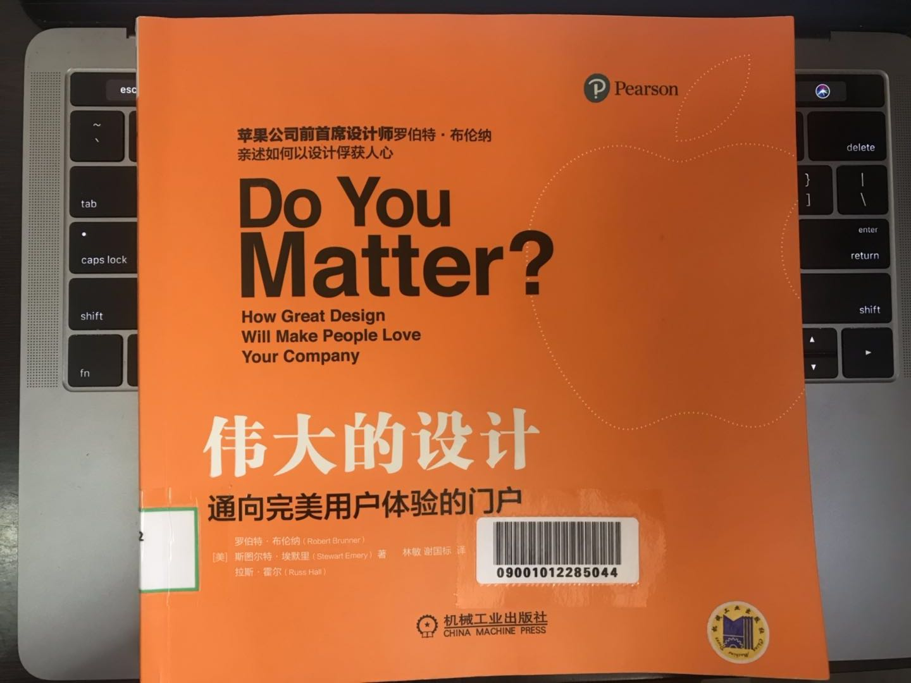

# 伟大的设计

## 一、设计，至关重要

### 1、伟大的产品关乎思想，而非形体

伟大的产品和不错的产品之间的差异就在于：

- 伟大的产品蕴含思想
- 一种人们可以理解的思想
- 一种人们可以学习的思想
- 一种与人们在情感上建立联系的思想
- 一种可以在人们心里滋养生长的思想

### 2、有效的设计以产品和服务为入口

有效的设计以产品和服务为入口，通过全方位的体验构建你与品牌之间的体验联系

## 二、你重要吗

- 你是谁？

- 你从事什么工作？

- 你为什么重要？

### 1、你的公司对你的顾客重要吗？为什么？

- 如果你的客户从情感上希望你可以获得持续的成功，那么你对于他们就是重要的
  - 保洁洗衣粉
  - 宝马汽车
  - 苹果手机
- 设计构成我们生活的基础，在任何时刻，哪怕只有一秒钟，我们都离不开设计
- 你只有与客户的需求和渴望建立联系，他们才会在乎你
- 实际上，一丁点情感上的起伏都会影响客户感知的逆转，从而导致他们离开原先体验很好的公司

### 2、伟大的设计必须超越可用性

- 伟大的设计不仅是可用的，而且是诱人的
- 对全方位体验概念的认同必须来自公司高层，并且包含足够多勇于进取的基层员工

用忠于自我的心态回答以下问题：

- 你的顾客在意你明天还在不在吗？
- 你的顾客具有那种类型的产品忠诚度？
- 你的产品体验是否跟客户建立起了正向的情感联系？
- 你的产品或品牌是否对顾客的生活产生增值？
- 你公司的每一位员工是否都理解他们在全方位体验设计中所扮演的角色？
- 你的回头客是因为他们真的想再次光顾，还是因为他们不得不再次光顾？
- 但出现竞争者或是希望改变的时候，你的顾客是否很容易说出：“再会，朋友”？
- 对你的顾客而言，你是个重要的朋友吗？

### 3、你和顾客之间建立起一种无须人工介入的直接联系

- 从经济的角度来说这非常有价值

- 伟大的设计才能实现这样的价值

## 三、如何变得重要

### 1、伟大的成功往往不是照本宣科设计出来的

- 通常是你有了一个创意
- 先从其中某个部分开始尝试
- 但看到一些效果后才近一步将其当作一个产品来推进

### 2、设计作为产品开发方法

- 设计，作为一个全面整合用户体验的产品开发方法
- 包含了：分享、运气和来自失败的教训

### 3、如何把品牌提升到你预期的高度

- 必须从内而外的设计，而不只是添枝加叶
- 你需要从头到尾审视你的事业，理解每个环节是如何跟你的顾客产生关联，然后必须决定如何设计整个顾客体验供应链，并着手完成真正的组织变革

### 4、不能为了发展牺牲体验

- 要凭借体验来带动发展

### 5、设计是一个有生命力的持续工程

- 它必须能够从错误中吸取教训，重塑自我，并始终能面对新的风险

### 6、成为设计驱动型公司

- 设计驱动型公司在整个过程都会关注用户，也就是驱动发展的根本
- 一切都源于一个创造情感回应的理念
- 让公司上下接受融入正向情感体验的设计理念
- 设计出一种独特并被高度认同的顾客体验，是唯一一个个真正的防御策略
- 如果对体验的细节的这种关注没有在产品中被设计进入，便贸然准备开始商品化，你绝无成功的可能，你的赌注也将血本无归
- 当一家公司建立起对设计驱动文化的持续承诺，把顾客体验作为定义伟大设计的标准时，他的顾客会反过来常常会允许这家公司偶尔出现一次失败

## 四、设计驱动

### 1、成为设计驱动型公司并不容易

你需要经过以下步骤：

- 意识到你现在所处的位置和你需要到达的位置
- 致力在信念上迈进一大步
- 引入新人，实施新举措，然后全力以赴
- 保持警觉，发现并满足顾客在情感体验上的大部分需求
- 对顾客体验供应链的所有细节有全面的了解，以保证最终的设计既合适又协调

### 2、意识到你的设计中哪些部分是竞争对手难以复制且真正标志性的体验是至关重要的

- 设计驱动型的公司都有一个人做着首席体验官的事情

### 3、苹果公司所具有的设计驱动的特点

- 自上而下的驱动
- 聚焦在设计驱动
- 与众不同的想法
- 快速制作原型并上市
- 以设计指导制造，而不是以制造来指导设计

### 4、伟大的设计不只是设计师的工作，而是每一个人的工作

- 确保每个人都有相同的价值观、相互理解、一起努力

### 5、驱动一个设计驱动型公司的因素

- 顾客的需求
- 在情感上回应这种需求的产品
- 设计、制造和发放这个产品到顾客手上的协调性
- 保持对顾客的新需求以及新产品的预见敏感性不断

### 6、作出根本性的改变

- 审视整体结构
- 如何分配资源
- 如何激励团队
- 企业文化是什么
- 如何从顾客体验的角度来开展工作

### 7、怎么知道顾客的感受

- 走出去看看人们正在做什么，如何做，他们的生活在发生些什么事，他们的烦恼有哪些，面对的困难是什么？
- 跳出自我，融入外界，直到获得一个真正有用的发现
- 以此为基础，绘制一张由创意、观点和假设构成的地图，并开始打造你们产品
- 把你的设计放在有此需求的人面前，对他们说，“来，用用看”，你就在一旁观察他们在使用中会发生什么

### 8、成本因素

- 很多人和公司喜欢本末倒置：首先考虑成本
  - 如果成本就是一切，那么你可能发现自己就是坐在路旁的乞丐，看着周围的其他公司风起云涌
- 如果让真正优秀的人来负责实现一个创意，并给出清晰的目标，他们迟早会将其实现
- 应该大胆的尝试，按照你想要的方式去构建产品，做到你能做到的最佳结果，然后让你的管理团队去想办法解决资金的问题

### 9、人力因素

- 当多学科的强大队伍携起手来，共同营建合作的氛围，并且一起探索不同观点的交汇之处时，真正的创新就会出现
- 设计师的加入，是多学科协作成功的关键
- 设计师提供一个所有人都可以使用的方法论以及一个引向创新的设计氛围
- 设计思维是将不同学科群体聚合起来去的成功的粘合剂

## 五、LOGO不等于品牌

品牌存在于用户的心里，一个品牌时关于一群人的直觉，当一群人有着一模一样的直觉感受，你就有了一个品牌

### 1、品牌的本质

- 品牌经理必须建立一项新技能，就是能够真正掌握和开发客户的一切体验
- 品牌会说话
  - 倾听产品和顾客之间的对话
- 当你的品牌和客户建立起良好的交流的时候，你就创造了一些期待；在购买之前，你的客户就对这款产品有所预期，在情感上已经提前接受了这个产品
- 公司标志和广告已经成为影响购买决策的一部分因素，但是，以往的产品和现有产品的体验才是影响销售的核心

### 2、把设计作为驱动因素

- 绝大部分从事产品开发的公司都把设计看成流程的一个步骤，而不是驱动因素
- 当你建立一个渗透到公司的开发、生产、运输和后续方方面面的整合设计体验时，你最终得到一个强有力的品牌

### 3、品牌关乎价值

- 深谙设计的公司也深谙价值
- 挑战之一是知道人们真正在意的价值是什么，以及他们愿意为什么东西买单

### 4、真酷，而不是装酷

- 学习现有市场的规格，目的为了打破这个规则
  - 琼斯饮料（从改变标签开始）

### 5、品牌要像人一样具有活力

- 性格的建立是关于道德、行为、待人接物和他人如何看待你上的，这和建立品牌是一回事

### 6、你的品牌活在顾客心里，你能做的只是去影响它

- CEO首先要考虑的是如何让设计能够进行有效的驱动，从而提升顾客体验
- 而不是如何减少员工成本、商品价格、以及其他外在的东西

### 7、怎么知道你做的好不好

- 一个新产品及其体验的主要敌人之一就是与业已形成的惯性之间的艰难对抗
- 顾客调研和员工调研并不能让你深入到他们心里
  - 通过调研你可以看到趋势
  - 但是很少能够说出他们心里对你的真正感受
- 确切的评估标准不存在，没办法把情感放到电子表格里进行计算
- 要么建立起对于消费者的敏锐嗅觉，要么从内部或外部聘请人才来帮助你塑造一个能实现一切的文化
- 将自己的亲身体验作为试金石

## 六、产品是体验的入口

- 以体验为始终
- 任何真正想要成为设计驱动的公司，都有责任将顾客体验状况视为公司生存的晴雨表
- 必须时常提醒自己要持续地重新学习，重新应用和重新体验顾客的世界
- 成为顾客
- 真正用心设计的产品或服务是一种象征，一个集合地，也是一扇为特定群体提供独特体验的入口
- 不要只是参与游戏，而要改变游戏，并用设计开拓新领域
- 顾客体验供应链管理首先将顾客的所思、所见、所闻和所感设定为目标
- 你必须让顾客体验供应链管理融入公司文化的各方面，还还必须以此评估并奖励你的员工
- 大规模外包的风险是你最终得到的是一个大杂烩，你不再知道的或拥有的东西，但仍需要你去加以管理

## 七、会说话的产品和服务

- 大多数商人很难意识到设计语言就是在讲故事；他抓着顾客的需求和渴望，编织成一个复合顾客期望的故事
- 所有的产品都会跟顾客沟通；你不需要很费劲就能看到不少公司在这一点做的很糟糕，或是没有把故事讲对，或是许下一些不可能做到的承诺
- 如果你在做东西，那么你就在向人们说些什么
- 在宜家，你的体验是多样的，这种混合的体验很大程度是宜家通过设计语言引导你主要到宜家店内真正聚焦的东西------具有可承受价格的品质家具
- 设计应该创造出能表达企业核心价值的产品或服务
- 设计不是一个声明，而是一个持续的对话；这个故事需要用连贯流畅的方式来组织，而不是将各种东西生硬地堆砌在一起
- 完善你的设计语言
  - 以自我定位为基础开始出发（你是谁？你做些什么？为什么它如此重要？）
  - 塑造那些必不可少的特质
  - 由你自己定义你是谁
  - 将顾客体验容易你的流程
- 创建一个标志性的产品，可以让你的整个产品线产生晕轮效应，从而提升所有产品的价值

## 八、伟大的设计源于企业文化

生活和商业同样充满了变化，因此需要一个以文化为中心的方式应对变化

设计驱动型公司的核心要素：

- 聚焦
  - 应该总是关注顾客体验上；
  - 你的整个组织文化，都必须跟你所追求的顾客体验保持一致
  - 这不意味着总是说好，而应该理解顾客的需求和欲望，然后满足他们
- 长期
  - 你的顾客所获得的即时满足与快乐，是建立在对顾客体验供应链的长期关注上的
- 真实
  - 你必须清楚顾客要逼你想象的更聪明和更有眼光；你必须真心实意并依承诺行事，不然人们会感觉不到它
- 警觉
  - 你的一部分警觉是叮住你的竞争对手，但不要浪费太多时间把他们当敌人
  - 要不断的做出卓越的设计并推向市场，你需要细心的打磨细节
  - 保持警觉让伟大的设计得以在整个系统中实现；如果你不看着它，设计就会下降
- 新颖
  - 新颖的一个理解就是与众不同，不照本宣科，跳出固有思维
  - 真正的核心在于风险控制和研究方法；研究有时候会阻碍新颖性，尤其是焦点小组讨论会出现中庸的思维方式
  - 想要80%的市场都爱上你的产品，你就要做好准备接受另外20%人的质疑
  - 要想实现目标，就必须接受风险
  - 至少在开始阶段，需要给予设计人员自由的空间，用设计和创意去探索和触碰边界
- 可重复
  - 作为设计驱动的公司，你甚至必须做到：用不同的方式将同样的事情再做一遍

## 九、伟大的设计成就未来

人们真正想要什么样的生活？

- 人们一直在寻找让他们感觉到更有活力的伟大体验；
- 人们做任何事情都基于对更好体验的期望；
- 人类努力改善所处的环境，追求人生的终极目标：幸福和快乐

你需要在你的产品或服务中以设计一个卓越的人类体验为开端；这就意味你永远要把人的因素放在第一位，以此识别人们对你说提供的产品的情感反应。这看似容易，实际很难，因为我们常常倾向于避开那些带有情感的东西

## 十、总结

### 1、设计至关重要

- 伟大的设计是你与顾客建立一个间接的联系，并为他们的生活创造价值的最好途径；它是你与顾客建立联系的方式
- 它是关于你的顾客所接触到的关于你、你的产品和服务的几乎全部方案所构成的广义的体验；我们称之为顾客体验供应链
- 它在本质上是感性的；你必须在脑中树立这一思想，不要回避
- 它应该是一个真实而诱人的想法；不要试图去模仿，做你自己，做优秀的自己
- 更为重要的是，设计应被视为你的企业顶层战略要素

### 2、设计是一个过程，不是一个事件

- 设计思维与过程需要融入你所做的一切之中，每天都应如此；你需要将它融入生活，以它为信仰；你需要管理它
- 设计是所有人的责任；作出伟大的设计并不只是设计师的工作；伟大的设计需要每个人的参与，从组织架构的顶层到底层，从流程的一端到另一端
- 顾客体验供应链需要持续地给予定义、提供人手、加以引领和管理；它是你的顾客体验生命线：你的顾客从你身上所看到的、所接触到的、所听到的、所闻到的和所感知到的
- 这些都需要远见、勤奋和纪律

### 3、如果容易，每个人早就做了

- 成为设计驱动需要重大的文化变革；你需要从上到下改变你的公司，准备好应对公司体系中的反抗者，战胜他们，继续向前
- 做出伟大的设计需要时间；在一切都在持续加速的当今世界，投入时间是很难的；但你必须得到正确的结果，这就需要时间
- 你必须去做这件苦差事；最佳方案通常是最难开发和实施的，但这必须成为你的焦点；经过几次以后，这会变得容易一些
- 毫无疑问你将会犯错；每个人都会犯错，包括苹果公司；从中学习就好，让自己变得更好
- 这需要金钱；无法绕过
- 你必须怀有信念与承诺；第一次失败的时候不要放弃；坚持住，满满地就会看到成效
- 信任你对人性的直觉和理解；说到底，你也是人，不是吗？