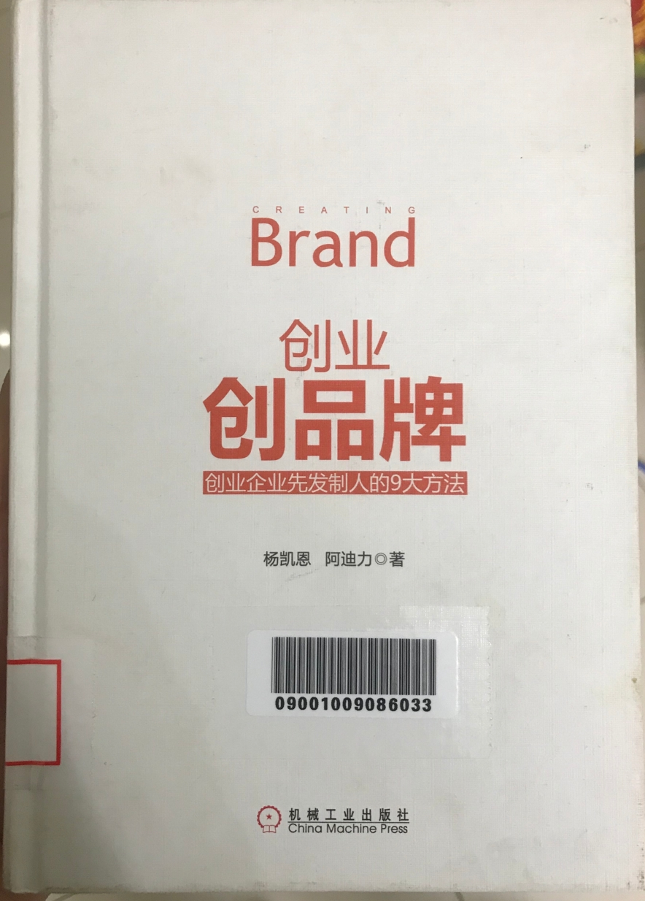

# 创业就是创品牌

* 如果你把产品当成竞争的终极武器，那么你即使短暂成功也终将失败
* 真正能让你赢得竞争的是品牌而不是产品
* 品牌才是企业的核心，创业就是创品牌

## 一、创业企业的品牌机会

### 1、商业的分化

* 自然界为商业界提供了现成的模型
  * 《物种起源》
* 品类是商业界的物种
  * 品类是顾客心智认知的品类，而不是行业或企业划分的“品类”
* 分化诞生新品类
  * 新品类会不断诞生
  * 老品类会不断消亡
  * 品类无法永生
* 进化提升新品类的竞争力
* 商业真是在分化和进化的不断交替中实现繁荣的

### 2、消费需求的多样性

消费者大致可以分为两个群体

* 一个是保守群体
  * 他们思想保守，判断保守，选择保守
  * 不敢尝新，害怕风险
  * 往往购买知名的领先品牌，是消费的主流人群
* 一个是开放的群体
  * 他们思想开发、独特、前卫
  * 他们乐于尝新，敢于冒险
  * 往往购买符合自己个性的新兴品牌，是消费的非主流人群
* 中国人口众多，贫富差距大，消费水平层级多且消费价值观迥异，给了很多细分市场的发展空间

### 3、互联网的大机遇

互联网经济正在如火如荼地发展着，它造就了很多成功的品牌，也给企业提供无限的品牌创建机会

* 首先，互联网是一个新兴的市场
* 其次，互联网是一个大市场
* 最后，互联网是一个口碑相传的市场

### 4、创业者的自身优势

* 创业者往往离市场最近，最了解市场一线的情况
* 大部分创业者有这样的勇气，不担心失去什么，只在乎想要什么
* 创业者往往从0起步，他们没有增长的压力，不需要养活一大堆人

### 5、大企业的失误

* 一个真正有潜力的新产品最初的市场需求并不明显，规模也很小
* 大企业往往会忽略这种市场
  * 要求市场对新产品已有明确的需求
  * 要求新产品的市场规模够大
  * 要求新产品的市场增长速度够快

## 二、成功品牌的真谛

### 1、品牌与商标

* 品牌是指在广大消费者心智认知中具有一定价值指向的产品名字，该价值主要代表了某个概念、某类产品、产品的某种特性
* 产品名称 != 品牌，商标 != 品牌

### 2、消费者的心智模式

心智是指人们大脑中过滤、理解、接受及存储信息的空间（百科：心智是一种意识活动）

品类是消费心智对产品相关信息的归类，它是消费者心智中描述产品的“信息小格子”

* 心智模式一
  * 以品类思考，用品牌表达
  * 消费者想要消费某个品类时，往往会直接购买某个品牌
    * iPhone
    * 王老吉
* 心智模式二
  * 在消费某个品类时，消费者心智中会自动形成该品类的品牌阶梯，指导自己的消费行为

### 3、品牌的二元法则

* 当一个品类市场达到充分竞争的状态时，会出现两个品牌共同主导品类的情况
  * 一个值得信赖的老品牌
  * 一个则是后起之秀
  * 奔驰宝马，可口百事，肯德基麦当劳
* 如果一个品类只有一个明显的领导品牌，就存在打造第二品牌的机会，甚至超越领先者称为第一（互联网品类，由于渠道的唯一性和虚拟性，某个品牌可能一家独大）

### 4、品牌背后的关键力量
* 真正促进人们购买某个品牌的根本原因是品类，而不是品牌本身
* 首选品类的领导品牌

### 5、品牌价值的决定因素
* 一个是品牌所属品类的市场规模
* 一个是品牌所占品类的心智份额
* 品牌价值 = 品类的市场规模 * 品牌的心智份额

### 6、强势与弱势品牌
* 一个真正成功的强势品牌，是消费者心智中某个品类的代表
* 很多所谓的品牌只是一个普通的商标，最多算是一个知名商标而已
  * 它没能在潜在消费者心智中代表任何品类，更没能主导一个品类
  * 不能称为消费者购买品类的首选，市场竞争力弱

## 三、创建品牌的七大误区

### 1、更好的产品就能赢吗

* 企业和消费者的思考逻辑是相反的
  * 企业认为更好的产品就可以卖的更好
  * 消费者认为卖的更好的才是更好的产品
    * 消费者对产品的了解有限，一般不可能拆开产品看材料和工艺
    * 也很难拿两个品牌的产品进行品质比较
* 举个栗子
  * 格力在产品上和美的、海尔、志高相比差距不大
  * 1991年开始聚焦空调领域，是一个专业的空调品牌
  * 多年宣传“连续XX年全国销量第一”，具有强大的品牌购买号召力
  * 人们更愿意买大家都在买的产品

### 2、创品牌还是卖产品

* 第一、品牌是产品的品牌，它不能脱离产品而存在，随着销量的增加，品牌自然能在消费者心中建立起一定的品牌认知
* 第二、如果品牌没有找到一个明确的定位，仅靠一个所谓的品牌形象或理念，确实无法有效促进产品的销售
* 第三、产品卖的再多，如果没能形成差异化的品牌认知，没有创建品牌，当竞争加剧后还能靠降价来维持销量，利润率必然下降，最后酒会被市场淘汰
* 品牌创建和产品销售是相辅相成的，品牌创建能推动产品的销售，产品销售有助于品牌的创建
* 举个栗子
  * 淘宝上大部分商家都是冲着卖产品去的，为了销量不惜牺牲利润，为了赚钱，不惜丢掉商誉
  * 随着大量创业者涌入线上渠道，电商变成一片大红海，创建起品牌的企业必然胜过那么没能创建起品牌的企业
  * 不懂得品牌创建只知卖产品的淘宝店大批关闭

### 3、能满足顾客需求就够吗

* 20世纪80年代，物质匮乏，产品有限，那时能够有效满足消费者某个需求的品牌确实可以得到很好的发展
* 然后现在物质极大丰富，能满足某一需求的产品很多，仅从满足消费者已有需求的角度出发，难有创建成功品牌的机会
* 现在创建成功品牌的关键在于发掘并满足消费者的潜在需求，即开创新的市场；通过在消费者心智中建立起差异化的品牌定位，才可能创建起一个强大的品牌
* 举个栗子
  * 海王银得菲：扑了个空
    * 康泰克因为PPA事件产品下线，海王药业推出海王银得菲，诉求“治疗感冒快”，却并不能有效赢得消费者；因为康泰克已经占据了治疗感冒快这个心智位置，不含PPA的新康泰克推出后，市场又很快回到新康泰克这边
  * 白加黑：发掘潜在需求
  * 蜜桃：跨境电商，逃不过巨头的魔爪（差异化思维还是不错）

### 4、提升知名度就能促进销售吗

* 知名品牌在市场发展初期，产品品质参差不齐的情况下，给消费者带去好品质的信任感，从而有效促进销售
* 随着市场的发展，产品品质大幅提升，且不断趋同，很多品类都出现多个知名品牌，这时品牌的知名度的作用就大大降低了
* 举个栗子
  * 恒大冰泉
    * 2013年11月推出，定位高端矿泉水市场，大量广告随即铺开，2014年广告费用20多亿，而2014年的销量只有10.9亿，作者亲眼见大商超1元甩卖然后将其下架

### 5、创建品牌就需要做广告

* 品牌创建的初期，并不应该投入广告，而应该采用公关的方式去传播品牌
  * 广告不具有可信度，特别是一个新品牌的广告，而公关主要是通过媒体和口碑的形式传播，具有更好的可信度
  * 现在是一个广告大爆炸的时代，广告太多，你的广告很容易被淹没，投入产出比往往不成正比，创业企业根本承受不了
  * 品牌经过一段时间的发展，在消费者心智中定位逐步建立起来后，确实需要加强广告的投入，目的是传播品牌定位，维护品牌并提升竞争门槛
* 举个栗子
  * 切糕王子：没做广告也打响品牌
    * 千里送切糕支援云南鲁甸地震灾区的公益活动

### 6、品牌就是一个形象或理念

品牌形象理论：消费者的需求分为功能性利益需求和感性利益需求，通过塑造一个良好、独特的品牌形象来满足消费者的感性利益需求，从而吸引消费者，获得消费者的好感并促进消费者购买

* 在市场竞争的初期，一个好的品牌形象确实可以吸引消费者眼球，增加消费者好感
* 现在产品爆炸、广告爆炸、信息爆炸，消费者无暇顾及你的品牌形象，何况很多品牌形象非常趋同
* 现在消费者只能接受简单而直接的品牌诉求，且更多的是把不同品牌的信息进行简单的归类，在发生购买行为时，从自己存储的信息出发进行选择
* 举个栗子
  * 王老吉：从产品包装到广告画面，都显得非常普通，甚至俗套，可以说王老吉的品牌形象很是一般，既不独特也没档次，但这并不妨碍王老吉称为中国最畅销的饮料

### 7、品牌延伸可以利用品牌资产

品牌延伸：是指将一个已经代表一个品类的品牌用到另一个品类上

* 一般人会认为这样可以很好借助原有品牌的影响力来推广该品类，从而节省推广新品牌的费用
* 问题
  * 潜在消费者会觉得这样做不够专业，没有权威性，对采用延伸品牌的产品难有好感，他们更倾向于选择该品类的专家型品牌
  * 品牌延伸会模糊原有品牌在潜在消费者心智中的认知，稀释品牌价值，降低品牌竞争力
* 举个栗子
  * 海尔从冰箱起家，先后进入洗衣机、空调、电视、小家电、厨房电器、电脑、手机等领域，而且均采用品牌延伸的方式
  * 结果是当各领域出现强势的专家品牌时，海尔在冰箱及洗衣机以外的领域都处于竞争劣势，空调竞争不过格力，电视竞争不过创维，豆浆机竞争不过九阳，微波炉竞争不过格兰仕，电脑竞争不过联想，厨房电器竞争不过老板，小家电上竞争不过美的

## 四、创建成功品牌的最佳机会

跟风：难以创建起一个成功品牌

模仿：不可能创建一个成功品牌

### 1、开创一个新品类

* 在一个行业，开启一个有潜力的新品类，让品牌成为消费者心智中新品类的代表，并且主导该品类，就造就了一个成功品牌
* 举个栗子
  * 万路宝：男人的香烟
  * 百事可乐：年轻人的可乐
  * 康师傅：瓶装绿茶
  * 脉动：维生素水
  * 香飘飘：杯装的冲泡奶茶

### 2、开创新品类的管理学依据

* 企业唯一的目的就是创造客户，这是企业区别于其他任何组织的最重要的特征
* 为实现这一目的，企业只有两项基本职能，那就是营销和创新
  * 营销是企业的外部职能，它的目的是将产品卖给顾客，在外部创造顾客
  * 创新是企业的内部职能，它的目的是创造满足顾客需求的产品，在内部创造顾客
* 开创新品类实现了营销和创新的统一
  * 在企业外部以市场竞争为导向，找到消费者心智中的品类空缺
  * 然后回到企业内部指导产品创新，研发并生产出满足消费者潜在需求的产品
  * 在通过营销的手段推向市场去创造顾客
  * 更好的产品并不能创造顾客，它只是对原有顾客的消费升级，而创业企业又凭什么可以拿出比领先企业更好的产品呢？
  * 不一样的产品（新品类）才能创造顾客，因为它提供了有别于原有产品的新选择

### 3、品类的基本类型

* 所有的购买行为需要回答两个基本的问题：一是买什么？二是去哪里买？
  * 买什么：形成了第一种品类的基本类型，即产品品类
    * 瓜子、运动鞋、内衣、空调、凉茶
  * 去哪里买：形成了第二种品类的基本类型，即渠道品类
    * 大型商超、便利店、电器城、大型购物中心、网上超市、网上综合商城、网上化妆品商城
* 白电、黑电、生活家电、厨房电器等并非真品类，它们属于“范畴性概念”，可以称之为“伪品类”
  * 辨别品类真伪一个方法就是看它是不是消费者做购买决策时涉及的最后一级分类

### 4、对品类的重要认识

* 行业划分的品类，从产品本身出发做出的物理分类
  * 轿车、卡车
* 心智认知的品类，是指消费者心智中对产品信息的归类，与行业划分的品类两者有时一致，有时不一致
  * 安全的轿车、彰显尊贵的轿车、有驾驶乐趣的轿车
  * 防蛀牙膏、美白牙膏
* 品类分化
  * 品类只会分化，不会融合
  * 分化是商业发展的基本规律和源动力
  * 大型计算机、中型机、微型机和个人电脑、笔记本电脑、平板电脑、掌上电脑
* 商业融合失败的例子
  * Win10操作系统，融合了平板、手机、PC的功能
  * TCL的信息家电
  * 会飞的汽车
  * 能在水中开的汽车
  * 咖啡可乐、奶咖、啤儿茶爽
* 品类分化不会自动诞生新品牌，只有将品类分化的趋势和企业发展战略相结合，并采取正确的品类品牌战略，才能诞生新的品类和代表品类的品牌

### 5、开创新品类的疑问

* 新品类的现有市场规模有多大
  * 可以参考主要竞争对手目前的市场规模
* 判断一个新产品是不是一个新品类
  * 要有明确的差异性
    * 消费者通过视觉、听觉、嗅觉、味觉及触觉轻易识别出其与众不同之处
  * 要有明确的价值性
    * 能有效满足消费者某方面的需求，或解决消费者某方面的问题

### 6、开创新品类的九大方法

#### 1）抢占市场空白

* 市场空白是指消费者存在某类产品的潜在需求，但市场上并无此类产品存在
* 创业者往往距离市场一线最近，因而了解市场情况，最有机会发现消费者的潜在需求及市场空白
* 这是任何大企业的老板都很难做到的
* 举个栗子
  * 乐凯撒：榴莲披萨

#### 2）抢占心智空白

* 心智空白是指市场上虽然已经存在某类产品，但在广大消费者心智中并未出现该类产品的代表性品牌
* 举个栗子
  * 嘀嘀打车：后来居上，成就霸业

#### 3）产品创新

* 通过产品创新，对已有的产品进行改良、升级或换代，是开创新品类最常用的方法
* 很多人从企业内部的角度出发，认为只是推出一款新产品，并不是新品类
* 需要从消费者心智的认知角度出去判断这个产品是不是一个新品类
* 举个栗子
  * iPhone：开创职能手机新品类
  * Nest：开创“智能恒温控制器”新品类

#### 4）方便性包装

* 在食品饮料行业，很多产品都是通过方便性包装开创了新的品类
* 举个栗子
  * 乐百氏：瓶装水
  * 王老吉：罐装凉茶
  * 金龙鱼：小包装食用油
  * 恰恰：袋装瓜子

#### 5）价格区隔

* 价格是影响消费者购买的一个关键因素，不同的价格不仅可以明显区隔不同的品牌，还可以去圈定不同层次的顾客群
* 举个栗子
  * 芙蓉王：开创了“20-30元价格档香烟”的新品类
  * 洋河：开创了“140-200元价格档白酒”的新品类
  * 美食家：开创“高价爆米花”的新品类
  * 小女当家：开创“高端中式简餐”新品类

#### 6）规格区隔

* 有形的产品总有尺寸、容量等规格大小之分，不同规格同样会在消费者的心智中造成不同的认知，进而成为消费者心智中不同信息格子（即不同的品类）
* 规格区隔是最容易被忽略的一种新品类开发方法，因为它太简单、太明显了（大道至简，何必追求复杂）
* 在产品爆炸的时代，选择已经成为一种障碍，消费者就需要更简单、直接的信息
* 举个栗子
  * 甲壳虫：开创“小型汽车”新品类

#### 7）聚焦一类产品或服务

* 在零售、餐饮及服务行业，聚焦是最重要的经营原则
* 小市场开杂货店，大市场开专卖店
* 通过聚焦经营某一类产品或服务，往往可以开创一个新品类或商业模式，从而建立起成功的品牌
* 举个栗子
  * 必胜客：聚焦披萨
  * 达美乐：聚焦披萨外卖
  * 肯德基：聚焦炸鸡
  * 麦当劳：聚焦汉堡
  * 星巴克：聚焦咖啡
  * 国美电器：专营3C产品
  * 都市丽人：专营女性内衣
  * 玩具反斗城：专营玩具
  * 哎呀呀：专营女性饰品
  * 优衣库：专营时尚服饰
  * 京东：专营网上3C产品
  * 当当：专营网上书籍
  * 酒仙网：专营网上酒水
  * 麦包包：专营网上箱包

#### 8）聚焦品类的一个次要特性或功效

* 每个品类都有不止一个特性或功效，品类的各个特性或功效的重要程度是不一样的
* 领导品牌往往占据了该品类最重要的特性或功效
* 随着品类消费的逐渐成熟，就会分化出不同需求的潜在消费者，他们对品类的次要特性或功效也有补考的兴趣或需求
* 通过聚焦品类的一个次要特性或功效可以开创一个新品类
* 举个栗子
  * 黑人牙膏：开创美白牙膏新品类
  * 云南白药牙膏：开创牙龈止血牙膏新品类
  * 田七牙膏：开创中药牙膏新品类
  * 乐行：开创”便携平衡车“新品类

#### 9）站在领导品牌对立面

* 如果采取和领导品牌对立的品牌战略，那就可以在消费者心智中建立起不同品类的认知，从而开创一个新品类
  * 产品可能和领导品牌并没有明显差别，但是潜在消费者会感觉不一样
  * 这里讲的对立是战略层面的对立，而不是战术层面的对立
  * 战略性的弱点往往就隐藏在战略性的优点（领导品牌去的成功的关键原因）的背面
  * 对领导品牌战略性的弱点进行攻击，使其难以反击，才是最佳的对立面战略
* 举个栗子
  * 怪兽：第一个采用16盎司易拉罐包装的能量饮料（红牛：采用8.3盎司）
  * 宝马：长期被奔驰压制，直到确定和奔驰相对立的品牌战略，宝马才翻身
    * 奔驰靠车体大、马力强、豪华、行驶平稳在消费者心中建立起“乘坐舒适的高档汽车”的认知
    * 宝马车体窄小灵活、让驾驶更有乐趣，并确定“终极驾驶机器”的宣传口号

## 五、创建成功品牌的十大要点

### 1、为新品类命名

* 新品类命名的基本原则：简单、直接、通俗、易懂并符合大众认知

* 新品类的主要命名方式：

  * 品类+品类
    * 维生素水：脉动
    * 大理石瓷砖：简一
  * 核心特性+品类
    * 智能手机：iPhone
    * 纯净水：怡宝
    * 功能饮料：红牛
    * 经济型酒店：如家
  * 核心原料（材料）+品类
    * 花生糖：黄老五
    * 葡萄酒：张裕
    * 苹果醋：天地壹号
  * 制作方法（工艺）+品类
    * 红烧肉
    * 手工面
    * 烤羊肉串
    * 膨化饼
  * 核心功能（用途）+品类
    * 减肥茶：碧生源
    * 登山鞋：骆驼
    * 保暖内衣：南极人
    * 去屑洗化水：海飞丝

  ### 2、为新品类定位

  * 确定合适的竞争对手
      * 找不到明确的竞争对手，就丧失了明确的顾客来源，新品类的发展就会失去方向
      * 爱迪生发明的电灯，竞争对手是蜡烛
      * 卡尔・本茨发明的汽车，竞争对手是马车
      * 黄老吉竞争对手不是其他凉茶而是汽水饮料
  * 符合消费者的心智认知
      * 酸梅汤：去油腻的饮料？
          * 明显不符合消费者心智认知，酸梅汤一般具有消暑开胃的功效，而非去油腻
      * 唱吧：你手机的KTV
          * 尽管呱呱K歌伴侣上线更早，也累积不少用户，但是“你手机的KTV”相当于给这个新品类做了一个定位，而这个定位恰恰击中很多用户的痛点
* 三种新品类定位方法
  * 抢先占位
    * 黄老吉：罐装凉茶
  * 关联定位
    * 七喜柠檬味汽水：非可乐
  * 重新定位老品类
    * 发掘老品类的战略性弱点，新品类提供的利益必须有充分的支持点
    * 斯科普漱口水：李施德林漱口水，味道差（药味重）的漱口水

### 3、取一个好的品牌名称

* 品牌命名的基本原则是独特、简单、顺口及反应品类属性或某种特性
  * 好的栗子：红牛、怪兽、小米、iPad、喜之郎、哇哈哈、恰恰、真功夫
  * 差的栗子：统一、原叶、东方既白、许个愿吧、张君雅小妹妹、水立方、京通工、京瓷
* 品牌命名的四个要点
  * 反映品类属性或某种特性
    * 好的品牌名能让消费者望文生义，反映出品牌所属的品类或品类的某个特性，给人以专家品牌的印象或产生正面的联想
  * 要独特
    * 不独特就容易混淆，就会失去品牌名的最基本价值---识别
    * 常见的误区是取一个通用名
  * 要简单
    * 现在是一个信息大爆炸的时代，品牌太多，性质容量有限且厌恶复杂
    * 一个长的、复杂的品牌名难以进入潜在消费者的心智，且很不利于口碑传播
  * 易于口头传播
    * 避免使用生僻字
    * 避免设计师作怪
    * 避免使用谐音字
    * 避免文字混搭
    * 避免文字混淆

### 4、给品牌设计一个独特的视觉符号

独特的视觉符号可以让品牌有效区隔于竞争对手，方便消费者选择和记忆，有些还能传递出独特的定位和价值

#### 1）选择品牌的主色调

* 选择能够凸显品类特性的颜色
  * 可乐是红棕色的，可口可乐选红色作为主色调，这也能体现可口可乐是正宗货的品牌认知优势
  * 新品类的开创者，享有优先选择颜色的权力，应该毫不犹豫地占据能够凸显品牌特性的颜色
* 选一种颜色比选多种颜色更好
  * 一种颜色会更醒目，更具有识别性和记忆性，一个品牌应该聚焦于一种颜色
* 选择基本色比选择混合色更好
  * 基本色：红、橙、黄、绿、蓝、黑、白、灰，黑白灰是中间色，一般做辅助色使用
  * 红色：暖色调，人们看到红色，往往会产生前进、靠近的视觉错觉，所以红色往往表示活力和热情，更适合快消品
  * 蓝色：冷色调，人们看到蓝色，往往会产生后退、远离的视觉错觉，所以蓝色往往表示和平和沉静，也表示智慧和远见，更适合高科技企业
  * 橙色接近红色，绿色接近蓝色，黄色处于光谱的中间，处于肉眼能识别的波长的中间段，是最亮的颜色
  * 白色代表纯洁，黑色代表奢侈，蓝色代表领先地位，紫色代表尊贵，绿色代表环保和健康，金色代表成功
* 选择和领先品牌相对立的颜色
  * 差异化是创建品牌的核心原则
* 长期保持品牌主色调的一致性
  * 品牌的创建需要一个较长的时间，品牌主色调一旦确立，就不能轻易更改

#### 2）产品包装

* 产品包装是视觉符号的第二大要素，产品包装就是产品穿的衣服，要建立品牌，就需要采取与众不同的包装，特别要和领导品牌区别开来
* 举个栗子
  * 可口可乐的弧形瓶
  * 好时之吻巧克力的小三角袋
  * 费列罗巧克力金色小球包装

#### 3）品牌标识

* 品牌标识是为代替品牌名称而使用的，目的就是代表品牌
* 很多知名品牌经常把品牌标识和名称放在一起，只是多此一举
* 品牌标识要求简洁、独特、最好寓意品类属性或品类的某个特性
* 一个品牌标识最好只指向一个品牌，否则就失去其代表性
* 举个栗子
  * 奔驰
  * 耐克

#### 4）广告形象／人物标志

* 经典的广告形象或品牌人物不仅是品牌重要的识别标志，还能传递出品牌独特的定位和价值
* 广告形象不易经常变化，这回造成消费者的认知混乱，且品牌信息无法积累
* 举个栗子
  * 万宝路：定位男人的香烟，广告宣传一直使用牛仔作为主角，购买者不乏女性

#### 5）产品外观

  * 独特的产品外观可以让消费者一样辨识出，加深消费者对品牌的印象
  * 举个栗子
    * LV包遍布包身的花纹
    * 宝马的前珊栏

### 5、聚焦一款产品

* 消费者心智容量有限，而且害怕混乱，产品线过长不利于在消费者心智中建立起新品类及新品牌的清晰认知
* 聚焦一款产品，可以大大降低消费者的选择障碍，有利于新产品的推广
* 另外从运营的角度来看，聚焦一款产品可以有效提升运营效率和降低运营成本，而且可以让企业更专注的做好产品
* 举个栗子
  * 金罐的红牛
  * 红罐的黄老吉
  * 反例：Apple watch
    * 价格从349美元到1.2万美元，共有34款
    * 如此宽泛的产品线，完全是一个营销的灾难
      * 让消费者无比混乱，无从选择
      * 花349美元买Sport版的无法在花549美元买不锈钢表壳版的朋友前炫耀
      * 花549美元买不锈钢表壳版的无法在花1w美元买18K进手表的朋友前炫耀
      * 智能手表是很时尚很酷的产品，如果不能耍酷不能炫耀，就会失去很多价值
  * 反例：中搜搜悦
    * 定位“我的移动世界”，服务项目很多，包含个性化阅读、兴趣圈社区服务、电商、移动网站导航、APP下载等
    * 你知道它是干什么的吗？你需要什么服务的时候会首先想到它？
    * 信奉所谓的“移动互联网生态”，试图成为一个“有容乃大”的移动互联网入口级应用，从而获得海量用户，进而大量变现，真是一厢情愿

### 6、界定原点人群

* 原点人群是新品类消费的高势能人群，他们可能是行业的专家或重度消费者，也可能是意见领袖
* 特别是专业性较强或者高档的消费品，例如专业体育用品、汽车、红酒，更适合从原点人群切入
* 这样做的目的
  * 吸收他们更有价值的建议，毕竟他们比起其他消费者更懂该类产品，从而有助于企业改进产品和提升运营
  * 借助他们的影响力推广品牌，因为他们在该品类产品上的消费具有示范带动效应，甚至能引领潮流
  * 减少企业推广新品类的风险，初期通过聚焦小部分原点人群，避免没有针对性的“撒大网”，减少投入，提升成功率
* 举个栗子
  * 耐克：从专业运动员切入
  * Facebook：从大学生到社会大众

### 7、确定原点市场（线下市场）

* 理想的原点市场应该具有如下特征
  * 当地消费者对品类或相关品类的消费基础好，消费观念较为成熟，对新品类的接受度高
  * 在目标市场中具有典型性和代表性，能产生辐射效应
  * 市场容量较大，有培育新品牌的“肥沃土壤”
* 举个栗子
  * 金六福：从郑州走向全国
  * 脑白金：从无锡走向全国

### 8、聚焦原点渠道

* 很多人认为新品牌一开始进入的渠道越多，销售网络越广，能见度越高，销售量就越大，就越有利于新品牌的推广，这是一个误区，缺点如下
  * 战线过长，会导致企业推广资源分散
  * 会吸引过多不适宜的消费人群
  * 会让企业失去产品和运营不断调整和完善的时机
  * 会过早地被强势对手盯上、封杀，对于初创企业，无异于一种“自杀”行为
* 举个栗子
  * 黄老吉：从餐饮渠道切入
  * 美即：从屈臣氏起步

### 9、采用公关的方式启动新品牌

* 消费者的心智缺乏安全感，为了避免风险，他们往往拒绝购买一个新品牌，因为新品牌缺乏认知度和可信度
* 公关是指通过媒体及消费者口碑等具有可信度的第三方来传播、推广品牌，可以有效减少消费者的顾虑，促进其尝试性的购买
* 消费者对新闻的关注度也远远高于广告
* 作为开创新品类的新品牌，其本身也蕴含很大的新闻性和公关潜力
* 举个栗子
  * 切糕王子：天价切糕事件，千里送切糕（云南鲁甸发生6.5级地震，阿迪力向灾区捐赠5000公斤切糕）
  * 美体小铺：天然护肤、环保事业践行者，绿色和平赞助商，参与“拯救鲸鱼行动”，成为媒体关注的焦点

### 10、投入时间和耐心

* 时间是打造品牌的重要的必要条件，创业者需要有足够的耐心投入到品牌的创建中
* 越是有发展潜力的新品类，起成长速度往往越慢
  * 新品类的完善和成长需要一个较长时间
  * 新品类被人们广泛认知和接受也需要一定时间
  * 互联网有时虽然可以加速新品类的发展壮大，但也需要一定的时间练好内功，蓄势待发
  * 一般而言，线下品牌需要3-6年的缓慢发展期，才可能迎来快速发展的拐点
  * 线上品牌，如果战略得当，有足够的资源投入，确实可以快速发展；不过过快的发展，容易让品牌风尚化，起也快，落也快

## 六、如何做好品牌经营

### 1、推广新品类

* 新品类刚推出的市场几乎为0，这需要企业投入足够的资源去开拓市场
* 这时品牌并无多大价值，企业应该教育消费者，推广新品类而不是品牌，只有新品类发展壮大了，作为新品类的开创者的品牌才更有价值

### 2、防止品牌风尚化

* 给足新品牌成长的时间
  * 新品牌的成长需要一定的时间，包括产品的改进、运营的完善和消费者的接受，都不能操之过急
  * 在这个浮躁之气盛行的商业社会，创业者必须有长远做事业的决心和耐心，而不应该想着尽快卖产品，尽快赚钱
  * 举个栗子
    * 黄老吉：为了让罐装凉茶适宜更多人经常性饮用，加多宝公司经过十几次配方和口味调整
* 谨防掉进“闪电战”的陷阱
  * 很多企业信奉品牌营销的“闪电战”，认为段时间内快速、大规模的推广能够引起消费者的广泛关注并引起消费潮流，进而快速抢占市场
  * 殊不知，短时间内大量广告投入，快速的广铺渠道，容易导致品牌“风尚化”，快起快落
  * 举个栗子
    * 哇哈哈格瓦斯：昙花一现

### 3、保持聚焦

* 为品牌增加更多的顾客，而不是为顾客提供更多的选择
  * 为实现公司业绩快速增长，创业企业最常见的做法是扩充产品线，为顾客提供更多选择，以求提升客单价或更好的吸引顾客
  * 事实上，通过扩充产品线的业绩增长没有多大意义，因为品牌涵盖的东西越多，产品就会失去差异化，竞争力就会减弱
  * 从长远来看，失去差异化的品牌终将被顾客抛弃
* 在尚未完全主导一个品类之前，不应该推出其他品类的产品
  * 开创新品类只是手段，目的是主导一个品类，从而造就一个成功品牌
  * 主导一个品类前推出其他品类，会分散企业的精力和资源，不利于原品类的推广，并削弱品牌的竞争力
  * 企业不应该以销售额的增长为目标，增长只是企业做对事情后自然而然的结果；为了增长而增长，最终必定会让企业陷入困境
* 推出其他品类的产品，最好启用一个新品牌
  * 真正成功的品牌是某个品来的代表，一个品牌只能代表一个品类
  * 很多企业没有这样做，以为这样可以有效借助原有品牌的知名度和影响力来推广新品，然而事与愿违
    * 品牌延伸会破坏原有品牌已有的定位，稀释品牌价值，从而降低品牌的竞争力
    * 采用延伸品牌的新产品不具有可信度，竞争力也不强，因为消费者会认为你做这个产品不够专业
    * 竞争不激烈的领域，品牌延伸短期或许有效，但长期来讲，面对强势的专家品牌时，延伸品牌就会难以招架
* 举个栗子
  * 海尔的“品牌大伞”（反例）
    * 海尔几乎无所不包，可是你买什么的时候会首先想到海尔？
  * 保洁的“品牌大树”（正例）
    * 品牌经理制度，每个品牌经理负责一个品牌，并相互独立运营，各自对地区总部负责

### 4、谨慎促销

* 降价促销是把双刃剑，杀伤的更多的是品牌自身；降价促销，短期可能会增加销量，长期来看会降低销量，因为你告诉顾客不要在正常价格的时候购买你的产品
* 从本质上讲，降价促销和打造品牌是背道而驰的
* 不要对新产品做促销
  * 新产品本身就该具有一定的吸引力，而不该通过促销来拉动销售
  * 刚推出新产品的时候，应该尽量采用公关的手段来传播和推广
  * 多数情况，人们并不会因为促销而购买一个不足够了解的新产品
  * 对于一个新产品，消费者的价格敏感性并不高，企业不需要自作多情通过降价来讨好顾客
* 尽量只对老顾客开展促销
  * 能有效回馈老顾客，增加他们满意度，并促进口碑传播
  * 如果新老兼顾，老客户就会感觉没有得到重视，促销效果反而不好
  * 奢侈品牌为了维持其自身的品牌身份和价值，绝不会轻易打折，在换新的时候真对淘汰品的打折促销也只会悄悄的通知部分优质老顾客
* 不要频繁促销
  * 频繁促销给人的感觉就是在清仓甩卖，是教育消费者不要在正常价位购买
* 尽量不要直接降价
  * 直接降价就等于告诉消费者你原来的定价太高了，从而失去品牌的信誉
* 促销的时限尽量短
  * 否则顾客不会重视，企业的正常销售也会受到不利影响
* 如果你想打造一个强势品牌，首先就要忘记促销
  * 促销，从根本上讲，反映的是企业（老板）短期的、急功近利的心态，而不是打造品牌的、长期的心态

### 5、用好公关

* 不以直接促进销售为目的，而是为了增加公众对品牌的了解和好感，最好能有效传递品牌的定位
* 举个栗子
  * 切糕王子：为高考考生补充能量
  * 红牛：“能量课堂，手机换红牛”

### 6、做好广告

* 品牌定位确定后，在合适的时间，通过适量的广告可以增加品牌的可见度，传播并加强消费者对品牌定位的认知，有效形成品牌竞争力，并提升竞争门槛，从而有效维护品牌

### 7、容纳竞争

* 新品类的推广和发展壮大，需要更多的同行加入，共同做大品类市场，更多的产品，更多的货架展现，才能吸引消费者更多的关注和消费热情
* 竞争对手的加入也可以促进品牌自身不断的完善和进步，从而走的更远

### 8、重新定位

* 作为新品类的开创者品牌，其在发展之处的定位就是新品类的定位
* 随着新品类的发展，越来越多的竞争对手加入到品类的市场中，且品类发展趋于成熟，这时就需要对品牌进行重新定位，以适应竞争需要
* 常见的定位有：品类开创者、正宗、销量领先、领导品牌等
* 举个栗子
  * 可口可乐：正宗货
  * 香飘飘：开创者

### 9、进化品牌

* 品类发展到一定阶段后，作为品类的开创者，应该不断改进迭代产品，进化品牌，以稳固自己在品来中的领导地位，同时引领行业的发展
* 举个栗子
  * swatch手表，诞生之初只是为了与来自日本的低端手表竞争，后来swatch找到新的方向，重点研发和生产时尚手表，从而开创“时尚手表”的新品类

### 10、分化品类

* 创建成功品牌的最佳机会来自于新品类，而新品类来源自老品类的分化
* 每个品类都有其生命周期，到了一定时间老品类就会走向衰亡
* 企业应该看到品类的发展趋势，把握分化的机会，适时推出新品牌，进入下一个打造品牌的过程

## 七、最重要的品牌法则

### 1、成为第一

* 成为第一胜过做的更好，在潜在消费者心智中先入为主，要比让他们相信你的产品优于该领域的领先品牌容易得多
  * 消费者的心智难以改变
  * 消费者心智时缺乏安全感的，他很难相信一个宣称更好的新品牌，从而不会轻易购买一个新品牌
* 第一的威力
  * 中国第一个进入太空的航天员是谁？第二个是谁？
* 成为第一的领导品牌
  * 在任何领域，领导品牌几乎都是那些第一个进入潜在消费者心智中的品牌
  * 烤鸭的全聚德、包子的狗不理、白酒的茅台、香烟的中华、花生油的鲁花、凉茶的王老吉
* 如何成为第一
  * 如果你不是第一个进入某个品类，那么就创造一个能使自己成为第一的品类
  * 开发一个新产品的时候，首先要问自己不是“和领先品牌相比，这个新产品哪里更好”，而是“这个新产品有什么不同，能否成为一个新品类”
  * 很多消费者会对”不同的产品“感兴趣，而很少会对”宣称更好的新产品“感兴趣

### 2、差异化

* 要么差异化，要么低价；在如今这个产品严重同质化的时代，没有差异化的品牌只能靠低价虚弱的存活，甚至淘汰出局
* 领导品牌拥有”最好的产品“的认知以及最高品牌溢价能力，所以可以活得最好
* 差异化是一个消费者认知层面的概念，而不是企业内部的概念，所以不能只停留在产品层面。
  * 产品不同的成分、工艺、特性、功效及包装这些是差异化概念
  * 成为第一、领导地位、经典、市场专长、最受青睐、热销及新一代产品这些也是差异化概念

### 3、聚焦

* 太阳具有比极光强大无数倍的能量，但由于分散，人的皮肤都可以照射太阳，而激光由于高度集中，可以轻松切割钢板
* 一个真正成功的品牌就是某个品类的代表，如果你的品牌过于分散，它就无法成为某个品类的代表
* 聚焦就意味着舍弃，没有舍弃就没有聚焦，如果你想为顾客提供所有产品活满足所有顾客的需求，你就不可能打造出一个强大的品牌
  * 如果格力没有舍弃空调以外的家电业务，就不可能造就一个世界第一的空调品牌
  * 如果玩具反斗城没有舍弃玩具以外的百货业务，就不可能早就一个世界第一的玩具连锁品牌
* 长期聚焦一类产品时，你就会在潜在消费者心智中建立起一个品类专家的形象，甚至会成为该品类的代名词
  * 空调不是格力发明的，格力做空调时，春兰是中国空调业的老大，不幸的是，春兰制订了2000年要达到180亿的销售目标，基于空调单品无法实现这一目标，春兰随后进入摩托车、卡车及高能动力电池等领域，业务失去焦点，品牌失去代表；而格力始终聚焦、深耕于空调领域，很快就超越了春兰
* 认知的聚焦
  * 是为了提升消费者认知的效率，主要体现在品牌对外传播的信息上
  * 举个栗子
    * 星巴克对外传播的一致信息基本是关于它高品质咖啡的，从而在消费者心智建立起“星巴卡==好咖啡”的品牌认知
* 运营聚焦
  * 是为了提升企业内部的运营效率，主要体现在品牌涵盖的产品线上，最佳做法是聚焦一个核心品项，然后围绕着这个核心品项合理的配置产品线
  * 举个栗子
    * 真功夫以香汁排骨饭为核心品项并主推，围绕周围还配有冬菇滑鸡、酸菜卤肉饭、肉饼饭、榨菜牛肉饭等
* 品牌的光环效应
  * 如果一个品牌建立起一种明显的认知优势，那么它在潜在消费者心中可能还会赋予它更多的认知优势
  * 举个栗子
    * 更安全的轿车也意味着其工艺好喝技术领先
    * 更防蛀的牙膏也意味着其专业度高及品质好
* 举个栗子
  * 长城汽车，在里斯中国的指导下，长城汽车开始品牌战略重整，核心策略是聚焦发展SUV，逐步放弃轿车，适当保留皮卡
  * 老板电器，在里斯中国的指导下，聚焦发展吸油烟机；传播以大吸力油烟机替代高端厨房电器，所有传播资源都投入到吸油烟机，其他品类不做推广；方太定位自己为“厨房电器”，然后在消费者认知中并不存在“厨房电器”这个品类，消费者普遍考虑的是“抽油烟机买什么品牌”、“燃气灶买什么品牌”，虽然消费者购买厨房电器有成套的习惯，而吸油烟机在厨房电器中，处于决定选择的关键地位。从实践结果来看，老板电器的做法更有效（不只是吸油烟机稳坐行业第一，燃气灶和消毒柜也在2013、2014年超越方太获得第一，并保持至今）。

## 八、互联网品牌战略

### 1、何为互联网品牌

* 只有因互联网而生且完全依托互联网发展的品牌才是互联网品牌

### 2、互联网的商业价值

* 互联网的商业价值主要体现在其作为信息与渠道两大载体的价值
* 把互联网当作载体就是利用互联网传播信息或销售产品
  * 传播信息与传统媒体区别是互动性
  * 销售产品和传统渠道的区别是直销性
* 如果你想要建立一个互联网品牌，你就不该只把互联网当作一个载体，而应该把它当作一项全新的业务来独立运营
  * 发展出全新的品牌战略及运营系统
  * 启用一个全新的品牌
  * 一个品牌同时进入线上和线下渠道就是脚踏两只船，就是典型的战略骑墙
  * 启用一个能与线下品牌相区隔的品牌，这样才能释放品牌的最大潜能，从而获得最佳发展

### 

