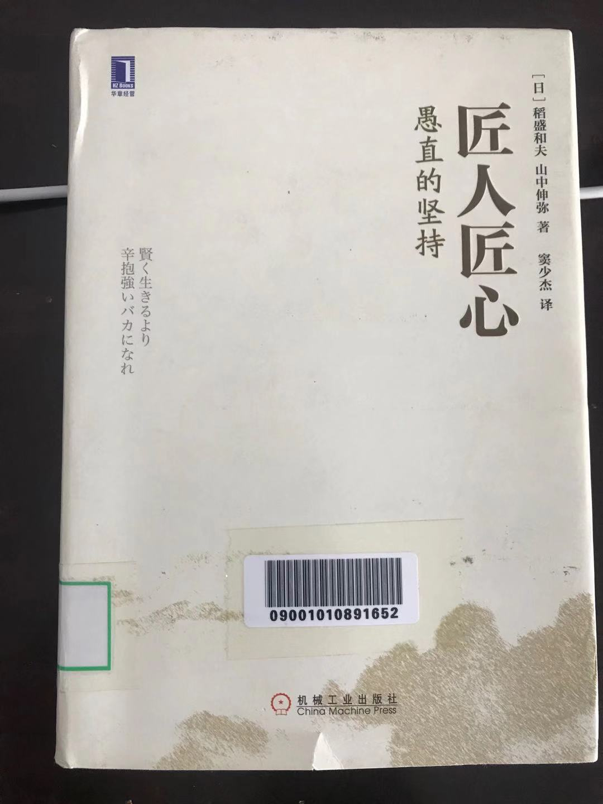

# 匠人匠心

ES细胞：胚胎干细胞，它具有体外培养无限增殖、自我更新和多向分化的特性，所以也称万能细胞。

iPS细胞：通过采用导入外源基因的方法使体细胞去分化为多能干细胞（初始化），对于这类干细胞我们称之为诱导多能干细胞（IPS，Induced Pluripotent Stem Cells）

## 一、原点是父亲的工厂

- 对曾是技术人员的父亲的崇拜

- 从父亲那里遗传制造精神的灵魂

- 从父亲那里遗传了谨慎，从母亲那里遗传了胆量

  - 无借款经营

- 事业的原点在于战败后的黑市

  - 海水制盐、卖盐
  - 地下偷制红薯酒、卖酒
  - 分区域卖纸袋子
  - **定价既经营：定价能反应经营者的能力的大小和经营哲学的内容**

- 母亲的教诲：**失败的责任在于自己，成功的功劳在于他人**

## 二、充满挫折和绕远路的人生

- 当临床医生遭遇挫折，回国后应研究环境巨大落差而抑郁
  - 别人20分钟完成的手术，我需要2个小时
  - 改行做基础研究
    - 临床医学的世界有完整的操作要领和规格，必须要按规定的流程和动作来完成每一项工作
    - 基础研究恰恰相反，反而是不能信任教科书上的世界，需要自己选择题目，自己设定假设，然后进行实验来验证；在进行实验的时候即便是出现了预想之外的结果，也有可能找到世纪大发现
  - 美国的研究所，分工做的非常细致也很到位，研究员只要专心做好研究就好
  - 日本的研究所，所有工作都要自己来做，从美国带回3只老鼠，半年变成200只
- 如果感到不幸，那就拼命工作，直到忘记幸与不幸
  - 毕业后到松风工业上班，战后10年连续赤字运营，和一起进入的4个同事有事没事就说公司的坏话，虽然想辞职，但是没有地方可去
  - 转自卫队的候补生学校，哥哥反对，没有寄户口本，只留下一个人
  - 发闹骚没人听了，却改变了人生。没有别的地方去，也没有别的地方逃，就只能专心搞研究了，这就改变了自己的心态，将所有心思放在工作上
  - 最后研究出全新的陶瓷材料，最先由美国通用电气研制成功，而我却用不同的方法，也制作成功了
  - 给日立提供陶瓷真空管，对方精度要求高，送了很多次样都被退了回来，被部长阻止研究，然后一怒之下辞职
  - 前任部长通过自己朋友，筹集300万日元，帮我成立京都陶瓷，当时大学毕业生工资也只有1万左右
  - **VW，Vision和Work hard的简称，将目标明确了之后，就要拼命努力去做** 
- 妻子是不可替代的战友
  - 你可要一直在我身后推我向前啊

## 三、奉献一切的觉悟

- 吃着便利店的三角饭团重建JAL
  - 重新抽上戒了多年的烟
    - 比起被巨大的压力折磨而死，还不如因为吸烟而死
  - 12岁犯肺结核，吃沙丁鱼粉末；65岁胃癌，切除2/3的胃
- 用愿景和努力付出别人3倍的努力
  - 做实验等结果的空档同时进行另一个实验
  - **只要决定了的事情，就不要感到困惑**
    - 从来不要去想“会不会成功”，“好担心啊”之类
    - 如果中途疑惑了，或者头脑中存在一丝担心，那可能就难以取得成功了
    - **不过在做出决断之前，会花上很长时间非常谨慎的进行自问自答：“动机是否至善，私心是否不存？”，做这件事是否符合世间大义**
    - **六项精进：1、付出不亚于任何人的努力，2、要谦虚，不要骄傲，3、要每天反省，4、活着，就要感谢，5、积善行，思利他，6、不要有感性的烦恼**
- 即便是两年赤字，也坚持到底的太阳能发电事业
  - 95年创建太阳能发电事业，一直赤字，到2012实现“发电全量国家回购制度”成为公司支柱产业
  - 大义：为解决能源问题和地球变暖问题做贡献
- 即然别人都不做，那我就来做，于是就举手成立了第二电电
  - 成立第二电电前，花了6个月时间，每天晚上睡觉前，都在不断自问自答：动机是不是为了国民着想，是不是为了降低点话费？是不是完全没有私心？**“动机至善，了无私心”**
  - **没有私心，就不会过多地纠结结果如何，而且会一直坚持下去**。我非常相信这一点。
- **人生/工作的结果 = 思维方式 * 热情 * 能力**
  - **思维方式：-100 ～ 100**
  - 热情：0 ～ 100
  - 能力：0 ～ 100
- 用没有偏见的心看事物
  - **在决定挑战谁也没想过，谁也没做的事情时，考虑太多不是好事。简单地想，然后大胆地做**。
  - **对预想之外的结果持有兴趣，这是非常重要的**

## 四、指向高峰的力量

- **想要不断努力，所以攀登更高的山峰**
  - 何等的境界，叹为观止
- 把攀登更高的山峰作为实现不断努力的手段，为此，需要不断地去选择攀登更高的山峰
  - 相信人类无限的可能性，所以要努力
  - **首先努力争取成为村里最优秀的企业，做到了之后，努力成为镇上最优秀的企业。。。最终目标是世界上最优秀的企业**
    - 有忍不住笑的员工，但是不要在乎，还是要不停的宣讲。作为一个领导，无论部下是否愿意听，都必须将自己认定的事情不断地向不下宣导，直到对方从心里认同
  - **领导必须不断的宣讲自己的经营哲学，而这能够成为部下工作的巨大动力**
- 重整JAL
  - 为什么答应去重建JAL
    - 如果破产，只剩一家航空公司，会形成垄断，票价会变得不合理，服务质量也会变差
    - 影响日本的整个经济
    - 在职员工失业后就业问题
  - 号召员工，每个人都在自己的岗位上加油、努力，无论如何也要实现我们公司的重建
  - 带入JAL的2样东西：
    - **按部门结算制度：让所有员工都有当事人的意识**
    - **我的经营哲学。经营目标：追求全体员工的物质和精神两方面的幸福**
    - 先对50个干部，花了1个月时间，进行领导力方面的培训，1天3小时的培训，1个月进行了17次，另外还进行了多次集训
    - **用聚餐会的方式推行经营哲学，员工自觉将顾客的满意作为第一目标**
- 用做人的正确标准来判断
  - 如果只是知道，并没有真正掌握
  - 需要实践
- 是跑马拉松还是跑100米
  - 找自己的节奏
  - 一开始就要全力以赴地奔跑

## 五、真正的领导者

- 对那些真心想工作的人展示梦想的力量
  - 用强烈的使命感和人间大衣感召大家
- **带着大善之心去斥责**
  - 批评斥责的目的是希望他成长
  - 就事论事，不要去攻击对方的人格和性格
  - 平时接触的时候，常把感谢的话挂嘴边
  - **大善似无情，小善如大恶**
  - **骂完之后，会跟他说明为什么会骂他，最后基本上会笑呵呵地跟他说“接下来要加油啊”**
- **领导的心胸决定组织的成败**
  - 做人何为正确
  - 利他
- 经商的精髓是“三方好”
  - 卖方好，买方好，世间好
- 公正无私
  - 领导者能不能做到公正无私，这直接决定他在部下中间的感召力

## 六、在激烈的国际竞争中获胜的热情

- 毫无仁义可言的知识产权争夺战
  - 新技术以企业机密的方式保留着
  - 80年代后，研发出来新技术，首先申请专利
- 作为领导，需要的是斗志，而不是竞争心理
  - 正确的做人，并始终坚持

## 七、科学进步能让人类幸福吗？

- iPS细胞是大善还是小善

  - 医疗技术的进步和老龄化问题之间的关系

- 天堂和地狱的区别

  - 乌冬面，一口大缸，1米长的筷子

  - 住地狱的人每人都争先恐后的拿着筷子往大缸里伸，由于筷子太长，很难将面送到自己嘴里

    ，容易引起大家的抢夺

  - 住天堂的人互相帮助，喂对方吃

- **人的心灵就是一个庭院，不播种耕耘，就会杂草丛生**