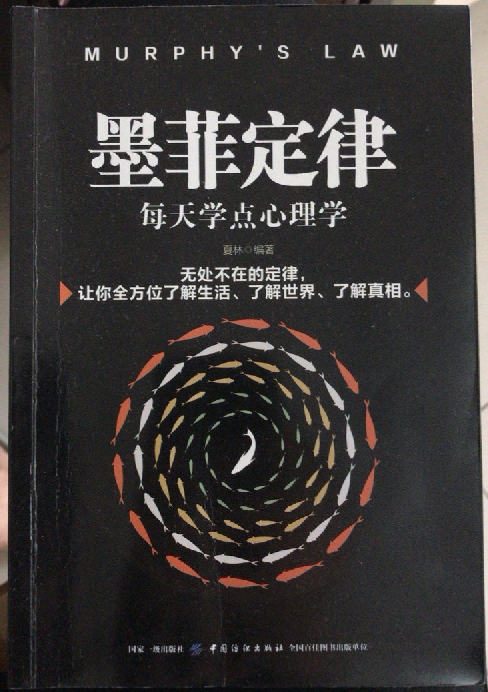

# 墨菲定律

原话：如果有两种以上的方式去做某件事，而其中一种选择方式将导致灾难，则必定有人会做出这种选择

如果事情有变化的可能，不管这种可能性有多小，它总会发生

## 1、钥匙理论--四两拨千斤

每个人对外界都充满警戒，就像心中有一把无形的大锁，只有懂得他们的心，理解他们的真实感受和需要，才能打开他们的心门

- 与陌生人初次交往时，最好在第一次谈话时打动对方的“心”
- 记住他人的名字，轻易的叫出来
- 直接表达自己的关心

## 2、心理共鸣--快速拉近双方关系

事物本身如何并不重要，重要的是如何看待他们。学会站在别人的角度看待问题，学会换位思考。

- 但沟通无效的时候，不妨问对方：“假如你站在我的位置，你会怎么处理呢？”
- 当和别人有不同见解和做法时，不妨从对方的角度和利益出发说服他

## 3、非理性定律--巧用感情打动内心

心理共鸣：指人在与自己一致的外在思想或其他刺激影响下而产生情状相同、内容一致、倾向同构的心理活动

- 打开对方的心扉，引发对方与你交谈的兴趣
- 不要太早暴露自己的意图
- 理想和家人事引发情感上共鸣的最好话题

## 4、焦点效应--把主角让给别人，赢得更多胜算

人都会用自己的好恶去评判一切，即使非常理性的人也不能不受情感的影响

- 不要试图与人争辩，是非对错没有好感重要
- 以理服人行不通的时候，以情动人更起作用

## 5、相悦定律--用喜欢引起喜欢

人性中最强烈的欲望便是希望得到他人的敬慕。想要得到别人的敬慕首先要敬慕和喜欢别人。当你满足了别人的交往需要，也就满足了自己的需要

- 用友善的态度对待他人，不要轻易批评任何人
- 增加对他们的欣赏和赞扬，努力做到喜欢他人
- 尝试与自己不喜欢的人交往，避免被阿谀奉承者包围
- 利用相悦定律带动更多人喜欢自己

## 6、首因效应--让初见你的人也对你倾心

人与人初次见面，45秒钟内就能产生第一印象，而且这种印象往往先入为主，不容易改变

- 得体的服饰、优雅的举止会给人留下美好的第一印象
- 发生意外一定要镇静，镇静而机智的解决方式可以让人忽略形象上的损失
- 首次进入社交场合，最好能够得到主人的介绍，以避免第一印象带来错觉，误交奸人

## 7、近因效应--更多的相处换来更多新印象

人际交往中，对他们最近、最新的认识往往占据主体地位，与首次见面时间间隔越长，越明显

- 不要轻易和他人产生矛盾，否则多年的友谊也会毁于一旦
- 如果留给别人不好的第一印象，不要放弃，慢慢和他熟悉起来，最终扭转别人对你的印象
- 严厉的批评之后，一定要有安慰或赞扬之语
- 当有一个好消息一个坏消息时，最好先公布坏消息

## 8、费斯诺定理--听取别人的，说出自己的

费斯诺：人有两个耳朵却只有一张嘴，意味着人应该多听少说。

不要让你的舌头超过你的思想。

- 倾听一定要真诚
- 一边倾听一边思考
- 应该对对方的话题有一定的回应，比如重复、简明复述，能够引起“惺惺相惜”之感

## 9、钓鱼效应--过于好奇使你更易上当

假如某样东西能满足一个人最强烈的内心需求，无论那是否是陷阱，他都很容易进入这个圈套

- 冷静思考。钓鱼效应利用的是人的好奇心和需求心理
- 当你发现自己的需求被激发起来时，应留心一下
- 恰巧很可能来自有心，不得不防

## 10、简单联想--是一种心理误区

简单联想：人类心理条件反射的一种表现方式

- 买东西的标准：品牌、价格、经验。价格最高的那种质量最好
- 不要让简单联想左右自己，理性分析

## 11、从众心理--不随波逐流

人常常会受到外界群体的影响，而不能保持独立性，使自己的知觉、判断、认识都因为符合公众舆论而出现扭曲

- 学会独立思考
- 不要盲目跟从，也不要盲目反对，遵从事实
- 学会忍受孤独和侧目

## 12、晕轮效应--不要被某一方面的特征说迷惑

晕轮效应：人对他人的认知首先根据个人的好恶得出的，然后再从这个判断推断此人的其他品质，往往以偏概全，使人们认识失真

- 不要在怀有成见的基础上审视他人的行为
- 与人交往的初期，不要对别人轻易下结论

## 13、不要因为他人的吹嘘引起嫉妒心

巴菲特：驱动这个世界的不是贪婪而是嫉妒

嫉妒：人们为竞争一定的权益，对相应的幸运者怀有一种冷门、贬低、排斥甚至是敌视的心理状态

嫉妒往往伴随着自卑、伤心、不安、焦虑、恐惧等负面情绪，使人非常痛苦，折磨人的心志

- 他人所强不一定是你最需要的，你有你自己的优势
- 嫉妒心理每个人都会有，做事必须有原则和底线

## 14、人言可畏，别人流言侵蚀内心

鲁迅：在我的一生中，给我最大损害并非书贾，并非兵匪，更不是旗帜鲜明的小人，乃是所谓流言

流言：广泛流传但毫无根据或来源的说法

心理学中，人们常常不看流言真伪，而重视其产生及传播的条件和过程

流言强度=事件的重要性 * 事件的不明确行 

- 平时谨小慎微，少让别人抓住把柄
- 流言四起时，可以把自己的一切行为变得更加明确

## 15、互补定律--性格互补的人相处更融洽

人们对自己缺乏的特质会有一种饥渴心理，如果交往的双方在气质、性格、能力、特长等方面存在差异或互补关系，则两个人不但相互吸引，而且最容易相处

- 与人合作时，要找与自己风格互补的人
- 与人交往时，可以表现自己性格不同的侧面来弥补对方的不足或吸引对方
- 互补的双方一定要尊重彼此的不同

## 16、登门槛效应--由小渐大，才能逐渐施加影响

一个人一旦接受一个微不足道的要求，为了避免认知上的不协调，他就有可能接受更大的要求

- 先提出一个较容易办到的请求，对方同意后再提出难办的事，对方更容易接受
- 从对方能够接受的小建议开始，逐步影响他人
- 把一件困难的事分割成一件件较小的目标，事情就会变得简单

## 17、权威效应--利用名人名言让对方深信不疑

一个人地位越高、威信越大，他所说的话就更容易引起人们的重视和认同

- 适当借用名人名言来推行自己的观念
- 利用权威效应暗示你的行动事有依据的，引导或改变周围人的态度和行为
- 设法取得权威人士的认同，有可能让你逐渐变成“权威”
- 推广某种产品或观念时，不妨首先先权威人士推荐，他们接受后，民众就很容易接受

