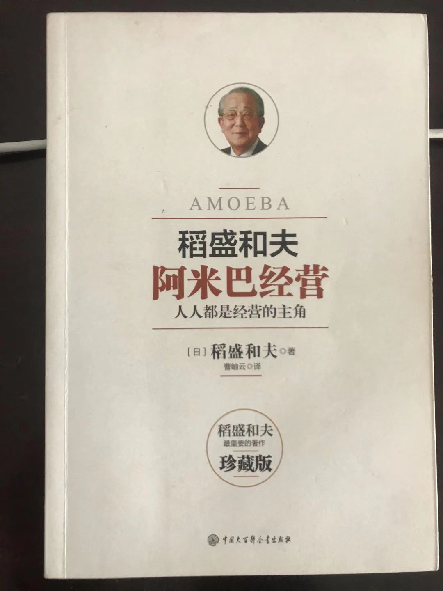

# 阿米巴经营

## 一、每一位员工都是主角
### 1、阿米巴的诞生

- 率领一个集团，归根结底，只能依靠人心
- 从公司的领导人到基层阿米巴的成员，都要用“信赖”这一纽带连接起来，这是企业经营的前提
- 思考公司存在的意义，公司的经营理念：“在追求全体员工物质和精神两方面幸福的同时，为人类社会的进步发展做出贡献”
- 阿米巴经营是通过一个个小集体的独立核算来实现全员参与经营、凝聚全体员工力量和智慧的经营管理系统
- 把变大的组织划小
- **公开公司的经营状况，可以提高员工的参与意识，激发员工的积极性**
- 阿米巴经营的目的
  - 确立与市场直接挂钩的分部门核算制度
  - 培养具有经营意识的人才
  - 实现全员参与的经营

### 2、目的之一：确立与市场直接挂钩的分部门核算制度

- 成本核算：需要的不是过去的数字，而是“现在的数字”
  - 面对瞬息万变的市场，需要在产品的生产过程中，对成本进行及时管理
- 判断基准：“作为人，何谓正确”
  - 判断问题，需要符合世人常说的“同逻辑、合伦理”
  - 判断基准也就是：也就是用“公平、公正、正义、勇气、诚实、忍耐、努力、亲切、体谅、谦虚、博爱”等词汇表达的世界通用的普世价值观
- **销售最大化，费用最小化**
  - 销售可以无限增加，费用可以降到最低，结果利润也可以无限增加
  - **定价为经营之本，找出客户乐于购买的最高价格**
  - 削减费用时，不能因为感觉上“已到了极限”而放弃努力，要相信人具备无限的可能性，要付出无限的努力
- 依据原理原则诞生的分部门核算制度
  - 要做到销售最大化，必须让各部门的领导者实际感觉到“销售”的存在，否则他们就无法产生让销售最大化的意志和热情
  - 各工序之间，采用半成品买卖的方式，各个部门就如同一个中小企业一样，成为一个独立核算单位

- 直接传递市场动向，迅疾应对
  - 阿米巴长在重要问题上虽然需要获得上司的认可
  - 但他们全面负责各自阿米巴的经营，包括
    - 经营计划
    - 实绩管理
    - 劳务管理
    - 资材采购
  - 在单位时间核算表中，不但要计算各阿米巴的收入和费用，而且要计算两者的差额--附加价值
    - 每小时的附加价值 = 附加价值 / 总劳动时间
    - 卖价的下降立即放映到各阿米巴之间的买卖价格上，所以各阿米巴就会立刻采取措施降低费用
    - 进行公司内部的买卖，在质量管理方面也会有很大的效果，如果质量不能满足要求，就不会从公司内部采购

### 3、目的之二：培养具有经营意识的人才

- 希望获得共同经营的伙伴
  - 经营者总是孤独的
  - 渴望能出现于我同甘共苦，与我分担经营责任的伙伴
- 拆分成阿米巴后，虽然只是小单位，但既然被授权经营，单位领导人就会产生“自己也是经营者一员”的意识
- **从员工的“要我干”变成领导人的“我要干”的立场，这种被动到主动的立场转变，就是经营者意识的开始**
- 从“干多少时间，拿多少报酬”的立场变为“自己赚钱，向部下支付报酬”的立场

### 4、目的之三：实现全员参与的经营

- 化解劳资对立的“大家族主义”
  - 劳动者只主张自己的权利，不去理解经营者的痛苦和烦恼；经营者也不去理解劳动者的立场，不想去改善劳动者的生活和维护他们的权利。双方都只顾自己的利益。
  - 经营者应该尊重劳动者的立场和权利；劳动者应该和经营者一起考虑整个公司的利益，为公司做贡献。如果劳资双方持有这样的观点，那么劳资对立自然就会消失
- 经营理念共用、信息共有，就能提高员工的经营者的意识
  - 经营理念：在追求全体员工物质和精神幸福的同时，为人类社会的进步做出贡献
  - 确立了这样的经营理念，经营者就敢于严格要求员工
  - **为了让员工具有经营者的意识，以经营者的思想投入工作，就要尽可能公开企业的有关信息，并且毫无保留地将我的烦恼、我的困惑统统告诉他们。这一点非常重要**

- 让全体员工在工作中感觉到工作价值，体验成就感
  - 有关阿米巴以及公司状况的主要信息，都要通过晨会等形式向员工公布。
  - 公司的信息尽量向员工公开，这就营造了全员主动参与经营的氛围，就能实现全员参与经营。
  - 员工不再是单纯劳动者，而是具有经营者意识的伙伴。这样的话，因为履行自己的责任，他们就会尝到工作的喜悦和成就感。
  - 阿米巴都设立目标并实现了目标，他们就能感受到工作的意义
  - 全体员工为了公司的发展，齐心协力参与经营，带着自豪感、成就感投入工作，实现全员参与的经营，就是阿米巴的第三个目的

## 二、经营需要哲学

### 1、阿米巴成立的条件是能够独立核算

- 组织并非分的越小越好
  - 第一个条件：能够独立核算，必须有明确的收入，并且能够计算清楚获得这种收入所花费的支出
  - 第二个条件：能够独立完成一项业务
    - 才有钻研、改进、创新的余地，才能感觉到工作的价值
  - 第三个条件：组织分割必须有利于贯彻执行整个公司的目标和方针
    - 销售部分为接单、跟单和收款部门，虽然可以独立核算，但是销售部就不能贯彻“客户第一”的公司方针
- 经常调整组织
  - 面对经济状况、市场行情、技术动向、竞争对手等环境的急剧变化，柔性地、灵活地改变阿米巴的组织，迅疾做出应对。
  - 领导人应该从提升效率的角度，对整个公司的组织进行经常性的审视和调整，去发现可以独立核算、应该“阿米巴化”的事业
  - 对阿米巴组织加以调整，始终让阿米巴组织处于最佳状态，这个问题非常重要

### 2、阿米巴之间的定价

- 需要公平公正的判断
  - 首先从最终卖价向前推算，由此决定各工序的价格
  - 决定阿米巴卖价的原则：制作该商品的各道工序都能获得大体相同的“单位时间附加值”
  - 应该按劳动价值的社会常识，对各阿米巴所需要的费用、劳力做出正确的评价，然后设定适当的、公平的卖价
    - 工序A技术含量低，工序B技术含量高，要按市场价格调整“单位时间附加值”，不能让工序A不努力也可以赚得很多

### 3、领导人需要经营哲学

