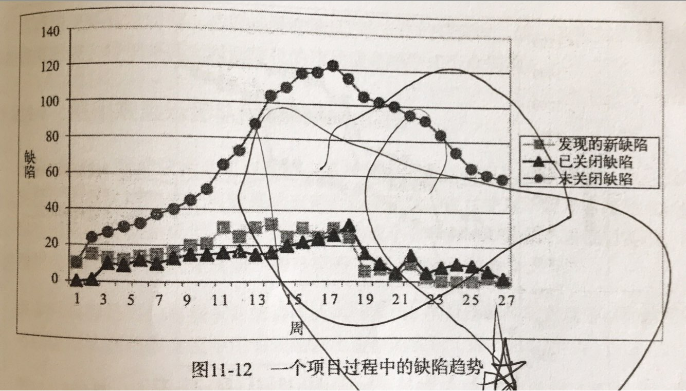
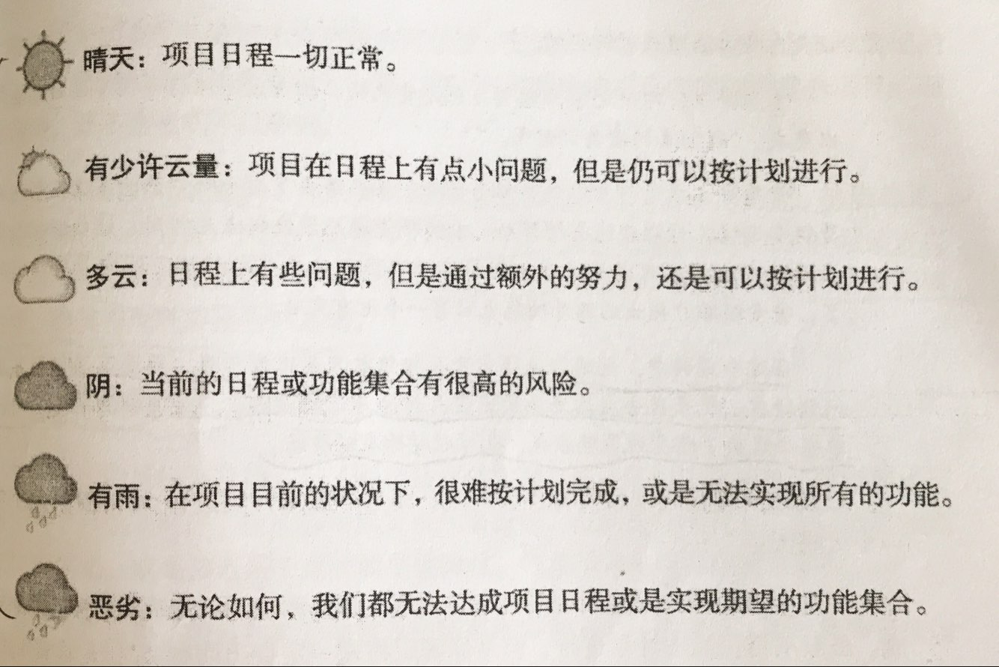

# 项目管理修炼之道

## 一、启动项目

### 1、定义项目和项目经理

* 项目：一个独特的任务或系统化的流程，其目的是创建新的产品或服务，完成交付产品和服务，标志着项目的结束。项目都有风险，且受制于有限的资源。
* 产品：项目所产生的一系列交付物。
* 项目经理：负责向团队清晰说明完成的含义，并且带领团队完成项目的人。完成是指产品符合组织对这个产品的要求，也满足客户使用这个产品的需要。

### 2、管理项目的关键驱动因素、约束和浮动因素

* 理想状况下，关键驱动因素应该只有一个，约束应该只有一个，而浮动因素可以有四个。
* 成本、时间、功能、质量。

### 3、与客户或出资人讨论项目约束

* 问客户是什么在驱动这个项目？

### 4、决定项目的关键驱动因素

* 驱动因素矩阵，草拟后让客户排序
  * 发布成本
  * 发布日期
  * 功能集合
  * 减少缺陷
  * 人员配备
  * 工作环境

### 5、应对喜欢过多干预项目的出资人

#### 预测未来

* 设想现在离项目预定的交付时间只剩3周，有功能未实现，同时有很多严重缺陷等着修复，问出资人该怎么办？

#### 使用与上下文无关的问题识别项目真正的驱动因素 

* 项目要怎么样才算成功？
* 为什么想要得到这样的结果？
* 这种解决方案对你来说价值何在？
* 这个系统要解决什么样的问题？
* 这个系统可能会造成什么样的问题？
* 少用“为什么”、“怎么做”之类的问题

### 6、编写项目章程、共享现有决策

#### 远景

* 每个项目的背后有一个缘由，发起这个项目的缘由何在？项目的价值何在？

#### 需求

* 在某个特定的日期到达之时发布某些功能

#### 目标

* 项目经理希望通过项目要达成的目的，客户可能不赞同这些目标
  * 重构解决技术债
  * 添加更多的自动化测试
  * 设计冒烟测试
* 项目不一定要交付它的目标

#### 成功标准

* 项目完成后，客户能用交付的产品做什么，这就是成功标准的定义

#### ROI（投资回报率）

* 操控数字太容易，不过可以试着去计算

### 7、理解质量对于项目的意义

* 根据项目产品所处的不同市场应用阶段，客户对于质量的定义也有所差别
  * 早期市场：关注于独特之处
  * 初期市场：关注于功能，可以容忍缺陷
  * 大众市场：关注于稳定和功能，不能有过多缺陷
  * 末期市场：客户群体日益增大，尽量要求减少缺陷，项目的压力会更大

### 8、小结
* 每个项目启动时都要有章程
* 对项目章程的反复修改要有心理准备
* 章程不一定完美，他的意义在于帮助整个项目团队进行规划活动
* 要知道质量的意义以及项目的驱动因素，这样随着项目的不断推进，项目经理和团队才可以做成正确的决策

## 二、规划项目

规划和日程安排是两种不同的活动。

* 规划：是指制订带有发布条件的项目计划
* 日程安排：是对项目工作的有序描述

### 1、踏上征程

* 人数不超过10个人，不妨一起完成项目规划
* 未来几天或几周要做什么？

### 2、使项目足以启动的规划

* 规划不必完美无缺，只要这个规划能让项目启动起来，同时让大家看到成功的希望，就可以了
* 时间盒：指特定的时间长度，个人或团队用它来完成每项特定的任务
* 用时间盒来限制启动规划活动
* 要根据经验而不是预言来规划项目
  * 先做少量规划，再根据实际收集到的反馈规划将来
  * 预言式规划试图预测未来，这很难奏效，除非你有水晶球
* 规划毫无用处，但是制定规划必不可少

### 3、开发项目规划模版

#### 产品意图

* 为什么公司要开发这个产品，它能为公司带来哪些效益
* 可以借用章程里的远景

#### 历史记录

* 复查已发布版本中发现的缺陷数量和类型，就可以理解即将使用的代码库中技术债务的严重程度和类型
* 对项目的情况知道的越少，将来感到惊讶的几率也就越大

#### 发布条件

* 详细列举项目产品的关键可交付物
  * 功能
  * 性能
  * 质量

#### 目标

* 产品目标（有点费解）
  * 不在当前发布版本完成的需求
* 项目目标
  * 缺陷数目明显减少
* 团队目标
  * 增加自动化测试比例
* 组织目标
  * 锻炼组织

#### 项目组织

* 明确说明团队在项目中的职责分配
* 指明项目经理如何使用生命周期组织项目工作，要采纳哪些关键实践
* 是否有决策人可以影响当前项目
* 如果使用受时间盒限制的迭代，需要说清楚每个时间盒的长度是多久
* 如果使用版本火车，要说明每列火车持续多久

#### 日程总览

* 日程总览里标有主要里程碑

* 说明里程碑或迭代的持续时间

* 说明里程碑或迭代结束后可以得到哪些产出

* 不要放工作分解结构（WBS），可以给参考链接
  * 工作分解结构：它是任务的组织形式，展示它们之间的依赖、持续时间和所有者等信息

* 以矩阵的方式给出项目团队不同的运作方案

  | 方案            | 实际时间 | 架构时间 | 开发时间 | 测试时间 | 文档时间 |
  | ------------- | ---- | ---- | ---- | ---- | ---- |
  | 功能1、2         | 2个月  | 1人月  | 6人月  | 6人月  | 2人月  |
  | 功能1、2、3       | 4个月  | 2人月  | 10人月 | 10人月 | 3人月  |
  | 功能1、2、3、4、5、5 | 12个月 | 6人月  | 60人月 | 50人月 | 8人月  |

#### 人员配备

* 要在何时需要多少人，需要何种类型的人

#### 建议日程

* 使用黄色便利贴安排日程
* 很少使用完整的甘特图
* 小心过早细化日程
  * 反复修订项目日程
  * 随项目进程补充细节

#### 制定项目风险列表

* 要将排名前十的风险记录在案

* 要经常监控这些风险

* 适当时机更新这个列表

* 项目风险如果不到10个，不妨和团队成员一起来一次头脑风暴

* 风险列表

  | 序号         | 描述                       | 发生概率   | 严重程度              | 暴露程度       | 反应时间    | 应对计划             |
  | ---------- | ------------------------ | ------ | ----------------- | ---------- | ------- | ---------------- |
  | 为每一个风险排定序号 | 用一个短语或一句话为风险命名           | 风险发生概率 | 如果风险发生，会造成影响的严重程度 | 发生概率乘以严重程度 | 应对风险的时间 | 风险应对方案           |
  | 1          | 除非到了项目的后期，否则不知道算法的速度是否够快 | 中等     | 高                 | （M，H）      | 7-14    | 增加测试人员，和开发人员一起测试 |
  | 2          | 启动操作2分钟                  | 低      | 高                 | （L，H）      | 8-21    | 在每次构建时监控启动过程     |

### 4、制定发布条件

* 发布条件会告诉你项目中“完成”的含义
* 避免大家对“完成”的定义各不相同
* 制订发布条件时，先判断项目的关键因素时什么？
  * 为什么公司要做这个项目？
  * 为什么客户会买这个产品？
* 项目经理和各职能部门共同商讨“成功”的含义，为项目经理指明了成功的方向
  * 销售人员能够卖出满足条件的产品吗？
  * 技术支持人员能够为这个产品提供技术支持吗？
  * 培训人员能否制定培训计划并展开相关培训？
* 确定当前项目最重要的因素
  * 客户关注的是这个产品是否解决了困扰客户的问题，而不会考虑其中有无缺陷或是缺陷数量
  * 有时，发布日期是最重要的
  * 有时，某一个或几个功能决定了项目的成败
  * 通常来说，日程安排、功能特性、和低缺陷率共同构成项目的关键因素
* 草拟发布条件
  * 如果条件许可，要在上市时间、客户需求、缺陷状况、性能和可靠水平之间达到平衡
  * 注明“草拟”字样，让大家知道只是供讨论的草稿，而不是已经作出的承诺
  * 发布条件草案样例
    * 所有代码必须针对所有运行平台编译并构建
    * 没有高优先级的Bug
    * 所有未解决的Bug和临时解决方案都要记录在版本发布说明中
    * 所有计划好的测试都要运行，通过率98%以上（比例可以讨论）
    * 在最后三周，未解决的缺陷数目要下降
    * 在发布之前，要由开发人员完成单元测试，由测试组完成系统测试，由客户A、B完成验证
    * 准备6-1日发布
    * 所有未解决的缺陷都要由跨职能团队进行评估（讨论有无必要）
* 让发布条件符合SMART原则
  * 要确保团队每个人对发布条件的理解完全相同，可以使用SMART原则：
    * 确定的
    * 可测量的
    * 可达成的
    * 相关的
    * 可跟踪的
* 在发布条件上达成多方共识
  * 取得共识的过程中，可以提以下问题
    * 在发布日期之前，我们是不是必须满足这个条件？
    * 要是我们不能在发布日期之前满足这个条件，会发生什么？
    * 如果不能满足这个条件，我们的产品或公司是不是会因此而承担风险？人们的安全感是不是会因此被破坏？
  * 通过以下方式来获得大家共识
    * 草拟发布条件，针对其展开讨论，在团队会议上就其达成共识
    * 与整个团队草拟发布条件
    * 与团队各职能经理一起草拟发布条件

### 5、使用发布条件

* 到产品发布的时候，发布条件职能有“满足”或“未满足”两种状态
* 要跟团队一起讨论距离满足发布条件还要多久
* 发布条件可以作为早期的告警信号，让大家知道团队可能无法准时完成当前版本
* 在接下来的每周项目团队会议上，用发布条件来确认项目在不断取得进展
* 下列两种情况发生时，项目经理可以考虑变更发布条件
  * 进一步了解项目中关于“完成”的含义时
  * 认识到无法在预定发布日期前满足所有发布条件时
* 如果管理的项目无法满足发布条件
  * 要跟团队确认为什么无法满足条件
  * 要向管理层解释无法满足条件的原因

### 6、小结

* 项目规划是在不断进行的，这只是开始
* 为项目团队、出资人和项目经理自己制定发布条件，以及明确定义“完成”的含义
* 项目规划不必完美无缺，但是必须要有

## 三、使用生命周期组织项目

一旦踏上项目之路，没有哪种生命周期是完美无缺的，可能需要对其做些拓展，并且不时修修补补，所选的生命周期模型要保证足够灵活。

### 1、理解项目生命周期

* 生命周期是项目经理和团队组织产品开发的方式
* 定义需求、设计、开发、测试以及这些工作同时进行的过程，都算生命周期的一部分
* 从整体上组织项目时，不要把现实情况理想化
  * 不要在规划时就希望能先产生完整的需求
  * 选择的生命周期能随着项目的推进不断发现新的需求
  * 选择的生命周期要有助于识别项目风险，帮助项目经理交付成功的产品
* 很少有项目能够沿着需求到发布这样一条直线推进，也没有多少项目能够规规矩矩按计划进行

### 2、生命周期概览

各种生命周期如何管理风险：

| 生命周期类型 | 范例               | 优势以及成功的必要条件                              | 项目优先级                | 成功预期               |
| ------ | ---------------- | ---------------------------------------- | -------------------- | ------------------ |
| 顺序式    | 瀑布、阶段-关卡式        | 管理成本风险；需求已知并已达成共识；系统架构已被深入理解；项目需求不会发生变化；项目团队不会发生变化 | 1、功能集合；2、低缺陷率；3、发布时间 | 成功，并可得到反馈          |
| 迭代式    | 螺旋、不断演化的原型       | 管理技术风险；不断演化的需求                           | 1、功能集合；2、低缺陷率；3、发布时间 | 迭代中的任务已经做规划，并按计划完成 |
| 增量式    | 项目日程由设计决定，并按阶段交付 | 管理日程风险；可以应对小的需求变更；但是难以处理影响到架构的变更         | 1、发布时间；2、低缺陷率；3、功能集合 | 成功                 |
| 迭代／增量式 | 敏捷（Scrum、XP）     | 管理日程和技术风险；如果团队成员不在同一物理位置，人员职能不完备，就难以实施   | 1、发布时间；2、功能集合；3、低缺陷率 | 成功                 |
| 即兴式    | 编码并修复            |                                          | 1、发布时间；2、功能集合；3、低缺陷率 | 不可能成功              |

各种生命周期的各阶段表示：

* 顺序式
  * 需求收集
  * 分析
  * 设计
  * 编码
  * 集成
  * 测试
* 迭代式
  * 需求收集
  * 原型阶段：分析、设计、编码
  * 原型阶段：分析、设计、编码
  * 原型阶段：分析、设计、编码
  * 集成
  * 测试
* 增量式
  * 收集部分需求
  * 分析选择整体架构
  * 设计、编码、集成、测试
  * 设计、编码、集成、测试
  * 设计、编码、集成、测试
  * 最终集成
  * 最终测试
* 敏捷
  * 收集部分需求和规划游戏
  * 时间盒
  * 时间盒
  * 时间盒
    * 每个时间盒产生已通过测试并可以运行的功能
* 生命周期组合创新
  * 了解初步需求
  * 将目前了解到的需求原型化，收集反馈，选择技术架构
  * 完整实现3个功能，并随即进行集成
  * 测试架构，演示现有功能
  * 继续实现，并不断集成
  * 最终集成

### 3、在项目中寻求反馈

* 开发人员首次获得代码的反馈是通过测试完成的
* 如果测试很晚才集成，这些反馈也是很晚才得到
* 开发人员得不到反馈，项目经理就很难评估剩余的项目风险、项目的状态以及团队的工作效率
* 缺少反馈的生命周期（顺序式）被称为“预测式”生命周期

### 4、大规模项目需要组合使用多种生命周期

* 没有哪种生命周期可以满足所有人的要求
* 对于大规模的团队或是多个地点展开的项目，可能每个团队都使用自己的生命周期

### 5、管理架构风险

* 架构风险主要是指团队选择的架构能否满足当前项目的要求
* 顺序式周期中，最终的集成和测试是在最后发生的，对于架构风险的控制是最差的
* 项目经理需要随时注意架构能否满足项目要求，这方面发现的越早越好，如果不能及时觉察，整个项目可能因此而功败垂成

### 6、从瀑布中摆脱出来

* 用迭代来规划所有的工作，包括规划、需求收集和原型化等工作
* 将产品原型化，并尽早先客户展示，从他们那得到的反馈越多，后面的日子越好过
* 从项目一开始就加入测试工作
* 功能要逐个实现，完成后随即进行集成和测试

### 7、我最钟爱的生命周期

* 尽早向代码库中提交功能代码
* 除非团队完成了几个功能的开发、测试、集成，否则架构师无法确定下来的
* 敏捷是首选的生命周期，如果客户没有足够投入、或者团队对敏捷式协作好无兴趣，可以选择阶段式交付生命周期，并用时间盒限制需求收集和架构设计阶段

### 8、小结

* 在组织项目时，要自由使用任何生命周期或是多种生命周期的组合，让项目踏上成功之路
* 不要怯于创建反应你自己项目实际情况的生命周期。“完美的”生命周期只是模型而已，你是生活在现实世界中的
* 阶段-关卡流程或瀑布式生命周期，只有在确定使用它可以获得成功时才使用，而不是不经思考，上来就用

## 四、安排项目日程

最初的规划只要能让项目启动就可以了。在安排项目日程时，要准备改进规划。在重新规划时，如果需要改变日程，也不必担心。

### 1、注重实效的项目日程安排

* 你之前的项目规划，足以启动项目了
* 接下来的日程安排，只要能把项目启动起来，也就行了
* 既然知道项目会随着时间演变，就没有必要详细安排整个项目的日程了
* 建议只思考接下来大约一周的事情，然后构建主要的里程碑，并对后续几周的工作进行波浪式日程安排
* 创建日程时，可以将生命周期用作指导方针，但不是严格的限制条件
* 日程排定要安排工作任务的顺序，展示它们之间的依赖关系
* 使用时间盒限制初始规划
  * 用一个小时制订项目的章程
  * 用一个小时完成项目的规划
  * 用一个小时完成日程安排的第一版草案

### 2、可供选择的项目日程安排技术

#### 自顶向下式日程安排

* 自顶向下式的日程安排通常从里程碑开始
* 将项目日程分为阶段、迭代或是几大块；把它们华仔白板上或者用便利贴粘在墙上
* 使用放在墙上的卡片安排日程，每个人把应该由自己完成的任务写在卡片上；然后再用线把卡片连接起来
* 最底层的任务越小，就越容易估算完成任务所需要的时间

#### 自底向上式日程安排

* 自底向上式的日程安排从特定任务开始
* 使用增量式生命周期时用自底向上还不错
* 项目团队成员会从任务中产生里程碑

#### 由内向外式日程安排

* 安排日程前，先画一个思维导图，把所说知道的和项目相关的有关东西都放进去
* 保证团队成员在一起制订思维导图，否则思维导图不好理解

#### 哈德逊湾式启动

* 运送皮毛的商船，离港后先停留在几海里的位置一段时间，确保不会忘记工具和给养
* 可以让项目团队先尝试在项目的实际环境中开展某些工作，目的是帮助理解环境；项目经理应该尽量缩短这个过程
* 使用时间盒来限制哈德逊湾式启动

#### 短期迭代

* 当团队对如何估算任务没有什么把握时，可以使用短期迭代
* 可以在哈德逊湾式启动后再进行一次短期迭代
* 使用时间盒限制短期迭代（不要炒作2周），再看看团队能够王恒多少工作
* 如果团队可以一起进行短期迭代和短期回顾，大家就能更清楚的知道如何安排当前项目的日程

### 3、用低技术含量工具安排项目日程

* 把任务写在便利贴上，然后在贴墙上，根团队成员一起讨论任务的顺序、任务的分配和风险
* 便利贴可以让整个团队参与项目的日程安排的讨论，团队也会不断说明对风险的理解，并为项目经理提供掌握项目的有价值信息
* 项目团队拥有时间表的所有权，它们就会对其负责到底
* 如果项目经理拥有所有权，这就像是在对团队展开微管理，导致管的太细，而不是管理他们任务之间的依赖关系

#### 使用便利贴安排项目日程的基本技术

* 团队全员参与，每人准备一叠便利纸和笔，准备一个可以粘贴的墙
* 将主要的里程碑写下来贴在墙上，这样大家可以看到项目的整体结构
* 让每个人把其所有的任务都写在便利贴上，一个便利贴写一个任务，写完后粘贴在墙上
* 墙上留一个区域用于粘贴问题和假设
* 项目团队成员一起讨论事件的顺序、前置条件、假定以及问题
* 项目经理如果看到很长的任务安排列表，就得问问团队是什么阻碍了他们以并行的方式工作

#### 使用便利贴和箭头安排项目日程

* 箭头可以辅助跟踪依赖关系
* 方便将结果录入日程安排软件
* 便利贴掉下来后，更容易知道原来位置

#### 为每一个职能组使用便利贴安排项目日程

* 按职能划分的团队会拖项目后腿
* 大白版画几条竖线，每条表示一周
* 使用不同颜色的便利贴表示不同职能组织的不同人的工作状况
* 同时标明项目的结束时间
* 按职能组织的项目在结束时会很难受，在项目最需要他们的时候，开发人员却很难全心投入

#### 按功能使用便利贴安排项目日程

* 将每个可交付物用一张便利贴写好
* 同时写好截止日期

#### 使用便利贴安排项目的好处

* 每个人都要有意识去思考关键路径

#### 基于可交付物的规划

* 使人们思考必须为项目剩下的工作交付哪些东西

### 4、小结

* 用低技术含量的工具开始安排项目日程。如果的确需要相关软件工具，过后再转换数据。
* 按可交付物安排日程，而不是按功能
* 要准备好以迭代的方式安排日程。一次性完成的项目时间表，起作用根本对不起花在上面的时间。

## 五、估算工作

任何通过计数或是计算的估算技术，都没有成功使用过

### 1、实用的项目估算方式

* 对比历史数据进行估算
* Delphi和宽带Delphi方式进行估算
  * 团队成员各自写下自己的任务列表和时间估算，同时注明自己对项目的预设条件
  * 团队一起开会，收集任务列表并复查，项目经理汇总
* 何时不应相信团队的估算
  * 不是每个人都善于估算，有些人会过于乐观，有些人会过于悲观
  * 总体来说，不要为任务估算添加过多松散时间，要提供一个估算信心百分比、一个日期范围，甚至可以考虑提供三个日期：最佳状况、最有可能、“墨菲”日期
    * 墨菲法则：如果某事可能会出错，他就一定会在最不应该出错的时候出错
* 小心顺序式生命周期的估算陷阱
  * 如果必须使用顺序式生命周期，是很难对项目做出准确估算的
  * 可以先动手做一点开发工作，测量完成这些工作需要多长时间
  * 再看包括多少类似工作量的工作，并通过迭代方式得到估算
* 使用自信心范围进行估算
  * 自信心范围图
* 使用日期范围进行估算
  * 可以让项目不至于受过早承诺之苦
* 使用三个日期：最佳状况、最有可能、“墨菲”日期
  * 最佳状况：在生产甘特图时，最佳状况日期就是工具提供的日期
  * 最有可能：在最佳状况时间上将一些经验系数、缓冲时间后纳入考虑之中
  * “墨菲”日期：在最有可能日期之上加上一些经验系数
* 规划扑克
  * 让所有团队成员都能参与到估算活动中
  * 每个人都估算任务的时间，然后讨论接受哪个结果
  * 用人时而不是人日进行任务估算
    * 一个很难在一个工作日完成8个小时的工作
    * 我说见过最好的状况，一天也就完成6个小时的技术工作
    * 由于各种会议或其他干扰，他们每天最多就能干4个小时的技术活
* 在估算前用试探性开发收集数据
  * 把任务拆分成一个一个的小块，每个小块耗时4-6小时
* 让估算更容易的方法
  * 记住，估算只是一个大概值
  * 很多软件开发人员都很乐观
  * 完成一项任务总是花费比预计更多的时间
  * 估算小块的工作更容易
  * 估算建议使用人时
  * 项目经理和团队需要练习估算并收集反馈
  * 做好反复估算的准备
  * 如果项目经理必须遵守某个截止日期，那就什么都别估算了，把所有工作按优先级排序，按优先级开发
  * 如果任务过大，不容易估算好，可以先试探性开发

### 2、用里程碑切分项目

* 用交付物作为里程碑，不要用于功能相关的活动

* 使用基于可交付物的规划来安排任务（而不是与功能相关的活动）

* 将里程碑的结束安排在一周中的周中，哪些完成哪些未完成，可以及时调整

### 3、能够不做哪些事情

* 能够以“不做哪些事情”的方式去思考时很重要的特质
* 不妨问问管理层“能够不做哪些事情”，如果都得做，那就帮大家澄清了他们的假设

### 4、身背多个项目时的估算

* 不要估算，也不能估算，想都别想
* 团队中有身背多个项目任务的成员，这个项目必然会延迟，而且项目经理都无法预测会晚多久
* 项目经理需要和出资人讨论：如果不能在我需要他们的时候提供这些人，那我就不能交付你想要的东西，不能满足你对时间和质量的要求，咱们看看哪些东西是你不需要的吧

### 5、主动安排人们进行多任务

* 有些职位不必专职投入（比如DBA、GUI设计人员）
* 项目经理可以让他们以周为单位来切换项目，确保一周只做一个项目的工作

### 6、使用波浪式规划

* 波浪式规划就是一个持续不断而且详细的日程安排方法，只覆盖几周的时间
* 完成一周详细工作安排之后，再继续安排一周详细的工作
* 使用四周的波浪式规划
  * 2周的时间太短，无法给我足够信息，难以预见风险
  * 多余4周容易犯错，并偏离安排工作
* 只要在项目进行时牢记每个里程碑，项目经理就会发现日程越来越容易维护了，花在上面的时间也就越来越少

### 7、决定迭代的持续时间

* 复杂的项目会有大任务，应该将它们拆分成团队可以在四周或更短时间内完成的小任务

### 8、尽可能使用“小石子”进行估算

* 小石子就是大任务被拆分成的小任务
* 每个小任务的完成时间不会超过2天
* 小石子只有“完成”和“未完成”两种状态，不存在所谓百分比
* 基于每天或每周规划的“小石子”是有用的
* 不要在项目一开始就定义所有小任务，毫无意义
* 项目中的每个人都可以划分自己的“小石子”
* 项目经理、技术带头人或架构师不要试图去为别人产生小石子（可以指导），这样就管的太死，陷于“微管理”

### 9、小结

* 绝对不要提供确定的项目结束日期
* 任务越小、估算起来就越容易
* 寻求估算的准确性，而不是精确性
  * 准确性：估算离实际情况有多大的差距
  * 精确性：测量的精密程度（比如某一天的几点完成）

## 六、识别和避免日程安排游戏

即使项目经理自己努力做好估算、规划和日程安排工作，你遇到的出资人、管理层、和团队成员还是有可能视日程安排为儿戏；项目经理需要把这些人带回现实。

### 1、给我一块石头

* 当出资人希望项目能更快交付，但是不告诉你何时需要或为什么的时候，就是在玩“给我一块石头”的游戏
* 应对实践
  * 提几个问题：日程、人员、功能、品质，什么是最重要的
  * 找出是什么原因促成他们期望的截止日期
  * 让出资人明白你做出选择以及背后的原因
  * 为你提供的日期说明信心范围
  * 在提供日期时要说明发布条件
* 反复发生的应对实践
  * 制订排好优先级的产品待办事项列表
  * 按优先级逐个实现功能
    * 如果让出资人更多的了解项目进程，他们就不会那么纠缠截止日期了
  * 使用短小的时间盒，这样出资人就可以看清项目进程
    * 如果每隔几周就能展示项目有价值的进展，截止日期就没那么重要了

### 2、“希望”是我们最重要的策略

* 仅有希望，不足以交付一个成功的项目
* 应对实践
  * 识别风险并记录下来
  * 不到万不得已，不要选择瀑布式生命周期
  * 可以用“哈德逊湾式启动”看看是不是能够做出什么东西
  * 确保大家具备相关的技术能力，还有解决问题必备的领域知识
  * 考虑所有工作都采取迭代的方式进行，特别是项目规划和日程安排
  * 由于缺少经验和专业知识可以寻求相关领域的帮助和信息
  * 制订里程碑条件
  * 使用有时间盒限制的迭代
  * 使用速度图表来展示项目进度

### 3、拒绝女王

* 有些老板不愿意面对项目延期的现实
* 应对实践
  * 找出拒绝的原因，可以尝试问一些上下午无关的问题：“对于这个项目来说，要怎样才算成功？”
  * 写下项目的风险及其潜在影响
  * 展示你能做的事情，并测量团队在项目中的实际开发速度
  * 保证参与项目工作的每个人都有相关领域的知识
  * 如果管理层认为“拒绝”是鼓励团队的方式，建议他采取其他鼓励技巧
  * 只要项目经理能够接受现实，“拒绝女王”就不一定能造成灾难
  * 现实总是会在某个时候跟“决绝女王”面对面，这不可避免
* 反复发生的应对实践
  * 制订排好优先级的产品待办事项列表
  * 按优先级逐个实现功能
    - 等到“拒绝女王”如梦初醒，团队也完成了若干高优先级的功能，这样项目经理也会得到一些有价值的东西
  * 使用短小的时间盒，这样出资人就可以看清项目进程

### 4、把灰尘扫到地毯下面

* 优先级的变更 — 灰都被扫到地毯下面了
* 应对实践
  * 把某个版本需要的功能先按优先级进行排序
  * 使用有时间盒限制的迭代逐个实现各功能

### 5、幸福日期

* 善于口舌的管理层，他们威逼、利诱、或用权力来说服项目经理和团队，让他们相信可以满足管理层对“幸福日期”的要求（加上逃避困难话题的文化使团队更容易接受）

* 应对实践
  * 说明日程安排范围
  * 使用迭代式生命周期，并说明将会通过信息方位实现哪些功能
  * 使用速度图表让每个人都了解进度

### 6、屁股着火

* 项目经理和团队周旋于几个项目之中，或是在两个项目之间不停切换，所有项目的紧急程度不断攀升、攀升、攀升。。。
* 应对实践
  * 考虑创建单一项目的工作环境

### 7、分散注意力

* 如果管理层无法把精力投入到一个项目或是项目群之中，就会引发此游戏
* 应对实践
  * 为每个项目设定一周的迭代，并确保每个迭代结束时有可发布的产品

### 8、日程等于承诺

* 日程安排只是估计而已，并不是预言，但是有些出资人会将这个估计视为承诺
* 应对实践
  * 当出资人要求得到承诺时，可以用信心水平与他们沟通
    * 比如90%的信心8-1号发布，100%的信心10-1号发布
  * 交付日期渐进法
    * 下半年交付 -> 某个季度 -> 某个月 -> 某天
  * 使用有时间盒限制的迭代，同时使用按优先级排序的待办事项列表
    * 迭代周期2-4周
    * 每个迭代的成果都可以投入使用
    * 可以应对任何时间的发布要求
    * 项目经理需要从出资人那得到承诺，需要说明哪个需求在何时需要

### 9、到了之后，我们会知道身处何方

* 出资人不停的改变项目的目标，当管理层无法或不想决定产品的方向时，这个游戏就发生了
* 应对实践
  * 确定已有的项目愿景、项目目标和发布条件，并就其达成一致
  * 如果出资人不愿意定义愿景，那项目经理就承担起这个责任，完成之后把它公布出来，并坚守这个愿景；如果做不到，就赶紧结束这个项目，再用新的目标启动新的项目
  * 用迭代来组织项目，如果已经达成足够多的目标，就结束这个项目，再启动新的项目
  * 不要允许别人让你的项目失去方向，否则只能发现自己陷入一片迷茫

### 10、日程安排工具总是对的（梦幻时间日程）

* 出资人希望在项目的第一周就看到甘特图，然后一切按部就班进行（关键路径永远保持不变）
* 原因：决策层看到的大部分报表都是由已完成的工作构成，而项目日程时对工作未来进程的猜测
* 应对实践
  * 制订波浪式规划
  * 使用低技术含量的日程安排技术，比如黄色便利贴
  * 提供带有信心水平的估算代替甘特图
  * 使用有时间盒限制的迭代，而且每次只规划一个迭代能做的工作
  * 用速度图表测量团队的开发速度

### 11、我们必须拥有这个功能，否则就完蛋了

* 出资人提出新的急迫的、重要的额外新功能，项目经理和团队也同意在当前版本加入；只是额外新功能的加入，会导致项目失去按日程交付的希望
* 应对实践
  * 要求改变功能集合
    * 看看哪些功能是这个版本不需要的
  * 要求更多的时间
    * 如果你愿意推迟交付时间，我们可以考虑加入这个功能
  * 如果按功能逐个实现，而且按期提供可供发布的产品，项目经理就可以和出资人重新安排下个版本要实现功能的优先级，使用不超过4周的迭代，人们最久只需要等8周就可以得到新功能

### 12、我们不能说“不”

* 当你开始更团队成员讨论这个新功能带来的影响时，大家都不愿意说“不”，大家两眼一闭，就把新工作接下来了，没有去评估对当前工作的影响
* 应对实践
  * 询问团队成员，看他们能否针对新加的额外功能制订计划
  * 如果项目团队说，“这次就忍了，会加班完成”
    * 可以考虑加班一周，看看工作效率如何，疲劳程度怎样，缺陷率有无提高
  * 有时可以加入额外的人力来做更多的工作（不一定总好使）
    * 如果组织中有人具备领域专业知识，而且团队也希望有这些人加入，可以考虑加入
    * 不要加入对产品或团队不了解的人
  * 如果以上方法都不起作用，项目经理就要帮助团队说“不”
    * 用数据来抵消团队的内疚或是反驳完成公司要求的渴望
    * 速度图表和迭代内容图表在这里特别有用
  * 如果项目经理不能帮助团队学会说“不”，那大家就踏上了死亡征途

### 13、日程小鸡

* 项目经理问大家进展情况如何，每个人都说自己在按日程安排进行，而实际情况却是没有一个人做到
* 应对实践
  * 避免逐个进行的进度报告会议
    * 每日站立会议
    * 每周一对一会议
    * 每周的电子邮件进度报告
  * 将任务分解成更小的部分，这样每人每天都能交付一、两小块任务
  * 按功能逐个实现
    * 如果有更多的人把精力集中在一小块可交付的功能上，就可以尽快完成这个功能，而且人们也更容易看到自己取得的进展
  * 考虑使用短期迭代
    * 就不必坐下来开每周的小组项目进度会议了
    * 有了每日站立会议，人们就不能掩饰自己的真实进度了

### 14、90%完成状态

* 很多技术工作者对估算并不在行，在任何情况下，但有成员以为自己完成了90%的任务，而实际还有90%的工作尚未完成时，“90%完成状态”就发生了
* 应对实践
  * 帮助大家定义出自己的“小石子”
    * 可以跟对方坐在一起，然后提问：“要完成这项任务，你需要多久？这周要处理的细分任务都有哪些？”
  * 要让大家把自己的工作进度展示给你
    * 代码中所有的覆盖情况
    * 风险列表
    * 测试用例
  * 教给大家如何跟踪自己的估算

### 15、我们马上会变得更快

* 项目经理一直在测量团队的开发速度，可是项目进展速度没有达到预期，由于某些原因，团队成员对于如期交付很乐观
* 应对实践
  * 与项目团队成员讨论紧张速度
    * 收集数据，什么原因让他们认为接下来可以更快
  * 测量估算质量因子
    * 每隔一段时间问团队成员“你们认为项目什么时候可以完成”，团队就预期时间达成一致，记录这个时间
  * 测量团队所做的每一件事，确定每个人都全力投入到项目中
  * 如果项目涉及到硬件组件、要测量其挣值
    * 计划值(PV，Plan Value)，又叫计划工作量的预算费用(BCWS，Budgeted Cost for Work Scheduled )。是指项目实施过程中某阶段计划要求完成的工作量所需的预算工时（或费用）。
      * 计算公式是：`PV=BCWS=计划工作量*[预算定额]`
      * PV主要反映进度计划应当完成的工作量，而不是反映应消耗的工时或费用。
    * 实际成本（AC，Actual Cost），又叫已完成工作量的实际费用（ACWP，Actual Cost for Work Performed）。指项目实施过程中某阶段实际完成的工作量所消耗的工时（或费用）。主要反映项目执行的实际消耗指标。
    * 挣值（EV，Earned Value），又叫已完成工作量的预算成本（BCWP，Budgeted Cost for Work Performed）。指项目实施过程中某阶段实际完成工作量及按预算定额计算出来的工时（或费用）。
      * 计算公式是：`EV=BCWP=已完成工作量*预算定额`
    * 进度绩效指标（Schedule Performed Index）。指项目挣值与计划值之比。
      * 计算公式是：`SPI=EV/PV=BCWP/[BCWS]`
      * 当SPI>1时，表示进度超前
      * 当SPI=1时，表示实际进度与计划进度相同
      * 当SPI<1时，表示进度延误

### 16、令人恍惚的日程

* 下周二，总部的大人物就要来视察了，或10个星期后就需要在展会上做演示，不管怎样，你要面对一个不可改变的日期，一系列充满也行或是不可能实现的功能集合
* 应对实践
  * 首先创建项目的仪表板（dashboard详见11章）
  * 测量进度
  * 测量速度
  * 如果还没有使用迭代式开发，把剩下的项目分解成迭代，迭代时间越短越好
    * 每个迭代要完成某个功能或一组功能
    * 包括功能的开发、文档、测试，以及其他产品对于“完成”的要求
  * 在一个迭代中要集中精力
    * 不要让团队成员受其他项目、未来工作或是技术债务干扰
  * 按功能逐个实现
    * 这样可能会产生不完整的系统架构，不过不必担心，如果一个功能需要架构提供某些方面的支持，团队会去实现的
    * 如果功能上不需要，那就没人会用它

### 17、小结

* 日程安排游戏总会发生，项目经理的工作就是要识别它们，然后管理项目，让项目仍然可以取得成功
* 绝大多数情况下，人们玩这些游戏都不是出于恶意
* 即使没有恶意，日程安排游戏还是会拖项目后退，使其停滞不前
* 如果能够以不超过4周的时间来组织项目，按功能逐个实现，随进度集成，并测量进展速度，就可以完全避免绝大多数日程安排游戏

## 七、创建出色的项目团队

项目经理要创建一个出色的项目团队，需要两个步骤，首先要招聘或引进所有需要的人才，其次要发挥他们的能力，一起工作，成为高效的团队

### 1、招募需要的人

* 团队中应该有下面这些角色

  | 名称    | 项目中的角色                  |
  | ----- | ----------------------- |
  | 架构师   | 组织并指导整个系统的开发，包括测试系统     |
  | 开发人员  | 设计、编写产品代码               |
  | 测试人员  | 设计、编写测试，包括测试代码          |
  | 技术文案  | 设计、编写产品文档               |
  | 业务分析师 | 收集、编写需求                 |
  | 发布工程师 | 设计、编写、维护系统，包括与系统相关的任何脚本 |
  | 项目经理  | 组织项目工作                  |

* 项目可能还需要其他角色（比如UI设计师、固件开发人员），项目经理应该知道项目中的技术风险何在，以确定哪些角色是必需的

* 如果项目经理没有吸引、招募或淘汰团队成员的权利，那失败几乎无可避免

* 小心只会用PPT的架构师

  * 不是每个项目都需要架构师
  * 如果架构师喜欢画各种设计图，不愿意写代码，开发人员想知道如何把设计结果融入到现有结果中，他也无法给出实质回答，那此人不算是一名真正的架构师
  * 架构师就像一只海鸥，突然出现，扔下一堆用PPT展示的不知所云的架构图，就像海鸥排下的粪便，然后就迅速离开了

* 项目的风险越大，团队的多样性就应该越丰富

### 2、形成团队凝聚力

* 帮助团队形成一体的最佳方式
  * 就是让他们一起工作，而不是去参加什么团队拓展活动
  * 如果大家有同一目标，彼此承诺完成相互依赖的任务，而采取商定好的工作方式，这就是一个团队
  * 如果希望团队凝结在一起，那么就帮助他们制订一些只有共同工作才能完成的短期目标吧
* 好工具让团队游好的发挥
  * 软件配置工具
    * 代码分支
    * 打标签
    * 自动合并
  * 缺陷跟踪系统
    * 优先级
    * 严重程度
    * 缺陷状态
    * 缺陷持续时间
* 团队发展的5个阶段
  * 组建期
    * 刚刚组建
  * 激荡期
    * 团队开始共同工作并彼此试探的时候
  * 规范期
    * 团队可以让彼此就大家的行为形成一致意见
  * 表现期
    * 团队可以工作干的不错，当大家更加紧密地协作时
  * 中止期
    * 项目完成，这个团队也就完成了历史使命
* 要想让你和同事可以协同工作，我所知道最佳方式，就是将所在团队的项目经理看作自己人，即使管理层并不鼓励这么做

### 3、让组织配合你的工作

* 为完成项目，最有效的组织会根据项目来打造组织机构，在这样的机构中，跨职能团队会向项目经理报告，项目经理管理每天的工作，管理团队和其他部门互动

* 实际上大多数项目经理都服务于职能组织或是矩阵组织

  | 团队组织方式 | 项目经理的权力 | 交付速度 |
  | ------ | ------- | ---- |
  | 项目团队   | 大       | 快    |
  | 矩阵团队   | 中       | 中    |
  | 职能团队   | 小       | 慢    |

* 在非项目型组织中，项目经理很难帮助团队形成凝聚力

  * 每个团队成员都要对单一职能团队负责，同时要对项目团队负责
  * 解决之道：团队成员先对项目负责，然后对职能经理负责

* 以项目经理的方式管理单一职能团队（各职能组都有职能经理）

  * 每个职能项目经理领取一些功能或是一系列需求，并使用跨职能团队来完成项目

* 管理矩阵式项目团队（团队每个人都有职能经理，而你还是他们的项目经理）

  * 为他们分配任务，并确保任务可以完成
  * 职能经理可能会觉得可以让下属参加多个项目
  * 项目经理需要和职能经理讨论多项目带来的延迟

* 管理跨职能项目团队

  * 要知道团队每个人的工作方式，这样才能提供有价值的反馈，并予以指导
  * 你不直接管理每一个人，你的下属项目经理和技术带头人就必须知道如何给出有效的反馈和指导

### 4、对必需的团队规模了如指掌

* 多于6人的团队建议拆分成几个小组，每个小组指定一个技术带头人
* 项目经理最多可以管理不超过9个人的团队
* 多于9人团队的问题
  * 团队的气氛会发生变化
  * 团队成员之间的关系并不紧密

### 5、知道何时应该加人

* 改变人员结构，团队会至少因此回退到震荡期，甚至可能回道组建期
* 如果雇佣新人，建议专门指定一个“伙伴”来辅导新人
* 项目刚启动，项目经理应该尽快加入需要的人手；每次人员变动都会对团队的工作效率产生影响
* 项目进行到中期，向进度落后的项目增加人手，只会使进度更加落后
* 项目快结束时，要避免新增人手，除非当前人手亿无法完成项目

### 6、成为出色的项目经理

* 提升人际交往技能
  * 倾听技能
    * 倾听团队的言谈、从他们那里了解项目的状态
  * 谈判技能
    * 争取资源、交换资源和信息
  * 写作技能
    * 编写计划，让每个人都理解计划并且做出妥协
  * 以目标为导向
    * 帮助大家把注意力放在项目目标上
  * 了解和尊重项目相关的工作人员
    * 要能看出别人什么时候陷入困境，什么时候出了问题，什么时候一切正常
  * 能够适应应对信息不足的状况，并且做出决策
  * 能够管理细节
  * 解决问题的技能
    * 哪些问题必须解决
    * 哪些问题可以延迟
    * 如何解决问题（三种备选方案原则：一种是陷阱、两种备选方案是两难的困境，提供三种备选方案，可以让相关人员开始考虑该怎么做）
  * 辨别、寻找进度的障碍，并清楚它们
  * 掌控项目的能力
    * 观察目前状况，指出项目当前方向与你最初的规划有何不同，并可以引导项目进入新的状态
* 提供功能性技能
  * 了解问题和解决方案的专业知识
  * 不要试图遮掩自己技术上的不足，敢于承认自己的不足，雇佣聪明人
  * 理解不同生命周期模型，知道哪一种最适合你的项目
  * 能够安排项目的日程规划
  * 能够估算任务，或者指导其他人完成任务估算
  * 知道如何评估风险、管理风险
  * 清楚如何度量项目状态，以及如何报告项目状态
  * 知道如何处理已完成和未完成的工作（速度图标和挣值）
* 提升专业领域技能
  * 理解人们如何收集和排序需求
  * 知道如何了解设计是否完成
  * 如何评估技术风险和日程风险
  * 知道软件配置管理系统的作用以及如何有效使用
  * 知道测试人员能够提供什么信息
  * 帮助项目团队选出最适合当前项目的审核活动
* 项目经理应该了解多少技术
  * 避免两种极端
    * 一无所知的项目经理
      * 要理解项目的流程，还要知道足够关于产品和工具的知识
      * 否则不能评估风险
    * 想成为架构师的项目经理
      * 会致项目经理的工作与脑后
* 项目经理需要PMP认证吗？
  * 不需要
  * 认证只能证明你很善于考试并且有些项目经验，并不能说明你在管理这些项目时有多么成功

### 7、知道何时该全身而退

一名出色的项目经理知道什么样的组织、团队和产品不适合自己

* 什么样的组织不适合你
  * 你不能选择团队成员
  * 出席会议变成行政任务
  * 出资人让你不得好死
    * 识别命令与控制式的环境，协作式的环境时绝大部分项目成功的必要条件
  * 出资人坚持认为人们都应该同时处理多个任务，而且不愿意做出改变
  * 别人想让你承担一些开发工作
    * 如果项目多于4个人，不建议这么做
    * 我看到的情况是项目经理没有管理项目，他们在编写代码，但是没有管理风险，没有留意开发、测试进度，没有产生仪表板上的数据，也没有评估版本发布条件，没有帮助大家看清目标、移除障碍
    * 你没有时间从事技术工作，得不偿失
  * 管理层强制切分项目工作
    * 开发测试被切换为两个项目组
  * 项目在启动时面临资源不足
  * 你总是听见人们所“你没法融入团队”
    * 如果你为了项目成功而推行的做法得不到认同，也许这个组织根本不需要你
* 什么样的团队不适合你
  * 对于管理项目需要的信息了解不足
    * 你知道团队时如何工作的吗？
    * 你明白这个项目是图解决什么样的问题吗？
  * 你的管理层非要给团队施加帮助，可你无法拒绝
    * 要敢于做团队的挡箭牌，让管理层的“帮助”落在你身上，而不是团队身上
  * 对于管理项目的需要的信息了解过多
    * 项目用到的技术你非常熟悉，能做到不去管技术，全心全意管理项目吗？
    * 干扰其他资深开发人员的技术工作，会让他们感到沮丧
    * 你也无法移出障碍、管理风险，更不用说帮团队完成项目了

### 8、什么样的产品不适合你

* 你不具备解决方案领域的专业知识，同时其他人也没有

### 9、小结

* 项目风险越大，团队的多样化程度就应该越高
* 提升多方面技能：人际交往技能、功能性技能、领域技能和非技术技能
* 知道何时应该离开

## 八、掌控项目

项目经理已经编写了项目章程，也有了相应的规划，团队知道“完成”的含义，也有了项目的日程。大家的工作正常进行着，做为项目经理，你的职责就是掌控项目，使其达到成功的彼岸。

### 1、掌控项目的节奏

* 下面是常见的打断项目正常节奏的问题

  * 不知道先要完成那些需求
  * 允许项目的需求收集阶段持续过长时间
  * 允许GUI随时发生变化，而GUI开发人员在项目中不知如何是好
  * 没有架构的整体描述，不知道各个部分如何构成
  * 无法及时向项目中加入必要的人员，使得他们很难取得成功

### 2、举行中途回顾 

* 了解项目中发生了什么，同时为未来的项目做准备
* 可以在每个迭代结束时举行回顾

### 3、为需求排序

* 可以避免“超高”优先级的需求

* 从1开始为每个需求分配一个唯一的数字

* 排序方法

  * 两相对比
  * 按评判标准排定优先级
    * 功能对架构的影响
    * 估算的实现时间
    * 该功能对于特别重要的客户的重要性
    * 特定人员实现或测试该功能的可行性

  | 评判标准             | 权重   | 方法1得分 | 方法1权重得分 | 方法2得分 | 方法2权重得分 |
  | ---------------- | ---- | ----- | ------- | ----- | ------- |
  | 功能对架构的影响         | 1    | 10    | 10      | 3     | 3       |
  | 估算实现时间           | 4    | 3     | 12      | 10    | 40      |
  | 该功能对于特别重要客户的重要性  | 8    | 1     | 8       | 10    | 80      |
  | 特定人员实行或测试该功能的可行性 | 2    | 10    | 20      | 7     | 14      |
  | 合计               |      |       | 66      |       | 137     |

* 制订并维护不断变化的需求日志：产品待办事项列表

### 4、用时间盒限定需求相关工作

* 用时间盒限制初始的需求相关活动，并持续收集更多的需求
  * 避免需求分析和定义过程占用过多项目时间
* 用时间盒限制所有的需求定义活动
  * 可能会招惹来“你是一个没有团队精神的人”之类的废话

### 5、将迭代限制在4周或更少的时间内

* 长期的迭代会掩盖问题
* 短时间迭代会让问题暴露的更加明显，项目经理就可以着手解决

### 6、使用波浪式规划和日程安排

* 用迭代的方式反复规划，就可以提升项目日程安排的准确性
* 先定义出主要里程碑，确保团队明白里程碑的特定含义
* 项目经理要做的就是监控项目进度，牢记里程碑的验收条件
* 团队一完成手上的任务，项目经理就可以向当前详细规划中添加新任务
* 如果后续阶段所费时间超出预期，就是存在技术债务的警讯
* 研究性项目或项目的研究阶段不适用

### 7、创建跨职能团队

* 各自为战使我们一叶障目，不见泰山
* 跨职能团队的工作效率更高
  * 不再把工作在各人之间传来传去，不在各自为战
* 跨职能团队具有多样性

### 8、根据项目的风险选择生命周期模型

* 根据你们的风险选择生命周期模型，选择哪些实践要考虑团队和所选生命周期的现实情况

### 9、保持合理工作时间

* 每天晚上都在公司吃晚餐好无道理，对任何人都是如此
* 一般来说，人们加班越多，他们能完成的工作反而越少
  * 人们每天最多只能完成6小时的技术工作
  * 在较短的时间内，有些人可能每天能多干1-2小时
  * 大多数人都不能进行长时间加班
  * 长时间加班会扰乱一个人的节奏，会让他把更多时间花在喝咖啡、打电话、浏览网页等和工作无关的事情上

### 10、使用“小石子”

* 如果要耗费很长时间才能完成一个任务，项目就会丧失节奏
* 团队成员看不到任务结束的时候，他们就会变的懈怠，从而没有节奏感
* 小石子可以帮助每个人保持自己的节奏，并让项目不致偏离正轨
* 通过指导团队成员使用“小石子”估算任务，或是使用有时间盒限制的迭代，就可以控制“学生综合症”
  * 学生综合症：直到最后一刻，有时甚至超过了这个时刻，才开始某个任务的工作

### 11、管理干扰

* 干扰是我们的障碍
* 应对其他项目的干扰
  * 要推迟来自其他项目对团队的干扰，除非当前迭代结束
* 应对其他人的干扰
  * 项目经理要鼓励团队成员及时讨论项目相关问题，项目工作会因此取得进展
  * 鼓励大家结对编程，这样人们就可以共同学些和了解系统
  * 可以让团队成员在隐秘的空间中讨论，从而不影响其他人
* 应对来自运营的干扰
  * 调出几个开发人员，用1-2周时间专门负责运营工作，并在运营期间调换这些人
  * 假定每个人每周只有2-3天开发时间，其他时间处理突发事件
  * 加入更多人手，专门负责运营，第二职责才是项目中的任务
  * 成立一个运营小组
  * 估算运营工作，然后将其加入到产品的待办事项列表之中

### 12、管理缺陷，从项目初就开始

* 如果项目经理不在项目初期就开始管理缺陷，那缺陷就会反过来控制你
* 为每个缺陷定义严重程度和优先级
  * 严重程度：属于问题的技术层面，如果程度很高，系统就无法运行，要么就回提供错误结果
  * 优先级：属于问题的业务层面，如果优先级很高，可能会受到问题的严重影响

### 13、如何影响别人

* 项目经理不需要提供所有建议和解决方案，你有责任让团队解决问题，而不是提供解决方案
* 思考你能为组织带来的价值
* 发现其他人或团队的驱动力
* 项目经理和负责人共同面对问题
  * 项目经理能够友善开放地接受他们的建议和想法
  * 如果你直接告诉别人怎么做，他们会有千千万万个理由告诉你“你错了”
  * 如果让他们自己去找答案，他们会更容易去解决问题
* 倾听团队
  * 团队会告诉你要怎样才能达到最高工作效率
* 在讨论时给他人思考的时间
  * 在推行你的想法时，要允许别人思考和质疑你的想法
* 不要固执己见
  * 你可以把自己的想法做为解决某个问题的起点

### 14、小结

* 作为项目经理，你要带头考虑使用或调整哪些管理实践
* 评估项目的问题，然后根据这些问题来判断使用或调整哪些实践
* 要寻找可以建立和维持项目节奏的实践

## 九、保持项目节奏

### 1、在项目中使用持续集成

* 持续集成：开发人员花1-2个小时编写一段代码，对其进行编译、测试、复查、构建，运行冒烟测试，并验证不会破坏现有的系统，再将其签入代码库
* 按阶段集成：开发人员只有在完成了某个功能的代码后才将其签入
* 频繁构建可以为开发人员提供反馈，同时让项目经理了解项目状态

### 2、为构建创建自动化冒烟测试

* 自动化冒烟测试，团队就可以知道是不是有人破坏了当前构建版本

### 3、按功能实现，而不是按架构

* 按功能进行实现和测试
* 产品的架构反应组织结构
* 按架构进行实现的坏处
  * 除非等到整个产品集成完毕，项目经理很难知道开发完的功能是否可以正常工作
  * 如果以架构为导向，产品中包含的组件就越多，这会阻止人们协同工作，并减缓项目进度
  * 难以完成完整的功能，随着工作的进行，他们也丧失了重构系统使之具备更高内聚性的机会
* 首先实现具有最高价值的功能
  * 先实现最优价值的功能
  * 把风险最高的功能往后放一放
* 按功能测试
  * 测试人员会按功能进行测试
  * 为了按功能测试，需要构建跨架构的团队

### 4、多几只眼睛盯着产品

* 邀请团队成员相互复查工作，形式不限
  * 结对编程
  * 伙伴复查
  * 同行评审
  * 走查
  * 正式代码检查
* 维持检查很困难，因为检查会会打乱每个人的节奏还有项目的节奏

### 5、准备重构

* 重构是对代码的简化，无论是产品代码还是测试代码
  * 重构不等于重新设计，只是简化而已
* 如果不准备在项目快结束时进行重构，代码量会居高不下
* 如果让重构和开发同时进行，重构的成本是非常小的

### 6、通过用例、用户故事、角色和场景来定义需求

* 减少不必要的代码的方法，想想谁会使用系统，又该如何开发用户需要的系统
* 需求收集的方法应该为项目团队提供上下文，这样才能深入理解需求
* 不要太过于专注于系统的内部功能，把希望捕获的用户重新排序，多想想应该为他们提供什么样的产品

### 7、分离需求和GUI设计

* GUI设计是要体现GUI如何引导客户使用系统来解决他们的问题
* GUI是设计，不是需求

### 8、尽可能使用低保真度原型

* 纸上的原型可以节省时间
* 高保真度原型会限制反馈，人们更愿意在纸面上考虑更多选择
* 纸上的原型可以帮助人们看到流程并做出评价

### 9、小结

* 项目经理可以邀请团队成员考虑这些实践，不过你不能强迫他们采纳这些实践
* 如果项目经理即使尽全力也只能选择一个实践，推荐选择持续集成
* 项目经理采纳和调整的实践要有助于保持项目的节奏，允许项目提供启动和结束的速度

## 十、管理会议

发现并摧毁浪费时间的会议，要让团队将注意力集中在项目上，保护团队不受外界干扰和影响

### 1、取消这些会议

* 不需要你解决问题的会议
  * 很多组织每周都有一些“状态报告”之类的会议，如果不需要你参与决策或是解决问题，这样的会议就不必参加
* 绝对不要举行多人参加的顺序式进度报告会议
  * 除发言人和项目经理之外，每个人都觉得很无聊
  * 顺序式进度报告会议不是会议，更像是一种注重形式的仪式
  * 改进实践：
    - 每日站立会议
    - 每周一对一会议
    - 每周的电子邮件进度报告
* 没有存在理由的会议
  * 有些会议似乎从远古时代就已经存在了
  * 会议最早的负责人早已离开原来的职位
  * 最初召开的意图已经消失不见，剩下的只有会议
* 没有会后行动的会议
* 上层主管的顺序式进度报告会议
  * 掠过这些会议，用电子邮件告知主管你的工作进度

### 2、举行下列会议

* 项目启动会议
  * 为整个项目设定积极的基调
  * 如果章程还未确定，和团队成员一起编写项目的章程
  * 如果章程已经编写，那就和大家把章程过一遍
* 发布版本规划会议
  * 规划出希望一个迭代交付哪些功能
    * 用规划扑克来估算功能的相对大小
    * 客户或产品负责人就要对功能进行排序
  * 重新排序产品待办事项列表
  * 会议结束成果：
    * 对于完成的定义
    * 可能的发布日期
    * 已经按迭代组织好并且有工作量预估的待开发功能列表
* 进度报告会议
  * 每日站立会议
    * 我昨天完成了什么
    * 我今天计划要做什么
    * 我面临哪些障碍
  * 每周的一对一会议
    * 问候
    * 讨论进度和状态
    * 讨论他们的障碍
    * 复查所有的行动计划
  * 通过可见的方式了解进度
    * 让团队成员说明他们的工作进度，包括他们下周要做的工作以及他们如何跟踪进度
    * 要求大家将任务分解成“小石子”级别的待办事项列表
  * 每周的电子邮件进度报告
    * 如果有每日站立会议，不必从团队成员那里获取每周进度报告
      * 工作成果：过去一周完成的工作
      * 未来里程碑：任务描述、规划完成时间、预计完成时间、实际完成时间
      * 障碍
  * 向管理层报告进度
    * 定期为管理层提供数据也许可以阻止他们管理的过死
    * 迭代结束时给管理层发送进度报告
* 项目团队会议
  * 要将项目团队会议作为解决问题的会议，而不是为了报告进度
  * 提纲
    * 议题、时间、地点
    * 期望与会人员
    * 主要里程碑检查
    * 本周遇到的问题
    * 其他话题
    * 回顾以往行动计划
* 迭代审查会议
  * 迭代尾声，团队会向产品负责人展示工作成果
  * 可以随工作推进不断检视并调整工作方式
  * 此外，团会会讨论开发速度图表等其他在项目仪表板上的团队数据，最终团队会进行一次中期回顾

### 3、会议疑难问题解答

* 每日站立会议超过15分钟
  * 保证大家都站着开会
* 报告正在进行中的工作
  * 将任务分解成“小石子”，确保报告已经完成的工作
* 没人能够及时参会
  * 重新商议一个时间
* 没人能在下次会议前完成各自负责的行动计划
  * 确保会后24小时内向大家发送会议记录
  * 如果有行动计划，写明每项行动的负责人和截止日期
* 与项目无关的人希望参加团队会议
  * 找出原因，为他设立一个角色
  * 如果有资深主管希望“帮助”团队更快完成工作
    * 让他看看项目仪表板，确保这位主管已经了解团队的速度以及团队成员的各自角色
  * 如果有主管希望通过“激励”团队来“帮助”大家
    * 可以告诉他：知识工作者的激励来自于内部，而不是源于外部
    * 给他几分钟时间，让他在会上讲几句，然后请他离场
  * 如果还有主管想旁听你的会议
    * 为他设立一个“观察员”的角色吧
  * 项目经理有时需要邀请其他人参加会议，好从他那里获得对于决策的意见或是收集数据，使得项目团队可以做出更好的决策
    * 会前说明这些人的职责，以及你将如何采用他们的意见
* 管理与远程团队的电话会议
  * 每个地点都会有一个引导人
  * 作介绍，各方介绍自己的名称和角色
  * 一次只允许一个人发言
  * 如果提到某个人，明确说出对方名字
  * 不要吃东西
  * 如需翻译，首先设定基本规则（说完一句话再翻译）

### 4、小结

* 你以判断一次会议对你是否有价值，知否值得你活着任何团队成员的时间
* 要想逃避瘟疫一样逃避顺序式进度报告会议
* 观察会议进程，看看是不是能够满足每名参会者的需要

## 十一、创建并使用项目仪表板

要想真正掌握一个项目，关键在于经常进行测量，包括定性和定量两种方式，并且要将结果公之于众，这些测量数据构成了项目仪表板

### 1、测量有风险

测量会面临3个大问题：

* 项目团队花费过多时间进行测量，从而影响正常工作
  * 要是你想要很多人配合，还是先加强项目在一些基础设施上的支持
* 人们不认真对待测量
  * 要确保存在多种测量方式，以评估项目的真正进度
  * 测量什么，得到什么
* 测量人，而不是项目
  * 如果测量的任何东西都可以直接跟踪到某个人身上，这等于是在对人，而不是项目
  * 测量人就等于鼓励他们不认真对待测量

### 2、使用速度图表跟踪日程安排进度

* 

### 3、使用迭代内容图表跟踪总体进度

  

### 4、计算软件项目的挣值并无实际意义

  * 挣值可以用来衡量到目前为止已完成工作的价值
  * 然而软件总是不断发生变化，要想计算真正挣值，几乎不可能

### 5、用EQF（估算质量因子）跟踪最初的估算

  

### 6、度量项目日程

  * 失去的时间永远无法再回来

  

### 7、人员分配情况

### 8、判断项目变化率
  * 基于模块间接口的变化情况判断需求变更的重要程度，只影响一个模块就是微小变更，影响多于一个模块就是重大变更

    

### 9、缺陷反馈率

  * 缺陷反馈率（FFR）：被拒绝修复的缺陷数与修复缺陷总数之比
  * 如果FFR高于10%，就说明开发人员遇到了问题，难以取得实际进展

  

### 10、测量查找和修复问题的成本
*  需要解释某种状态的时候，适合采用表格展示定型数据

| 阶段    | 需求     | 设计     | 编码    | 测试    | 发布后   |
| ----- | ------ | ------ | ----- | ----- | ----- |
| 成本    | 1      | 10     | 100   | 1000  | 10000 |
| 项目1成本 | 未测量    | 未测量    | 0.5人日 | 1人日   | 18人日  |
| 项目2成本 | 0.25人日 | 0.25人日 | 0.5人日 | 0.5人日 | 8人日   |

### 11、缺陷趋势
  * 未关闭缺陷曲线斜率变成负值时，发布版本的风险降低

### 12、展示测试进度

  * 无论采取何种生命周期，都应该将测试和开发结合在一起

  

### 13、展示采用的实践

* 不要强迫人们做的更好，应该去发现妨碍他们成功的原因

### 14、度量敏捷项目

* 速度图
* 测试进度图
* 迭代内容图
* 实践雷达图（可选）

### 15、使用项目气象报告

* 以数据为依据，建立可信的气象报告
* 每周发布气象报告

### 16、小结

* 使用速度图和迭代内容图作为首选
* 数据是工具，不是目的；要记住，图表应该为你服务
* 如果无法获取需要的数据，项目经理就遇到了比数据更严重的问题，先解决这个问题吧

## 十二、管理多地点项目

### 1、尽可能让团队坐在一起

* 沟通成本低

### 2、识别项目的文化差异

* 文化的差异体现在
  * 可以讨论哪些话题
  * 给予哪些奖励
  * 对待彼此的方式
  * 对行为的期望

### 3、在团队间培养信任

* 确保每个地点都有完整的项目可交付物
* 确保各个团队可以相互协作
  * 相互依存的团队之间不能存在竞争关系
* 让人们建立个人接触
  * 面对面个人接触中彼此建立的感觉，可以让他们在及时聊天或邮件上的沟通更有效率
  * 人们离得越远，就越有可能对你产生误解

### 4、在团队间使用互补实践

* 使用互补生命周期
  * 不要使用顺序式生命周期
* 详细说明每个团队的里程碑和交接物
  * 详细说明每个词汇的含义
  * 详细说明里程碑的含义
    * 确保每个人对里程碑的含义都有相同的理解
    * 使用期望的结果定义里程碑
* 详细说明团队了解自己工作进度的方法
  * 管理多地点项目时，不要强制规定每个团队如何达成可交付物，应该说明你想要的结果
    * 通常已经成熟的团队都会有成型的实践
  * 无论管理哪种团队，都应该以结果为重，而不是方式方法或具体实践
* 详细说明团队如何评审工作产品
  * 技术评审可以提供额外的沟通框架和上下文，人们可以借此机会讨论项目问题
    * 评审章程
    * 评审需求
    * 评审架构
    * 评审规划
    * 评审日程表
  * 对于使用迭代和敏捷生命周期的项目，要求只评审当前迭代的需求和架构，而且重点评审接口，而不是功能的内部实现

### 5、寻找潜在的多地点项目和不同文化导致的问题

* 不同地点的团队对里程碑和交付物的定义可能不同，这会让团队无法正确理解他们应达成的承诺，还有交付给其他团队的工作成果
* 项目进度的沟通和报告出现不一致，经常在项目初期发生
* 对于彼此沐浴不同的项目团队成员来说，可能很难理解对方在说什么
* 节假日、假期和加班都有可能产生沟通问题
* 时差导致的问题
* 使用一些通用工具的水平差异

中途回顾有助于识别并解决这些问题，还能帮你发现并解决项目的特定问题，如果项目经理无法召集所有人，可以在每个地点进行回顾活动，并将各地的项目经理叫到一起，解决跨地点的问题

### 6、项目外包需要注意的问题

* 外包负责人需要了解产品
* 挑选厂商
  * 有相关领域知识
  * 财务上是否可靠
  * 厂商是否会侵犯相关知识产权
* 与接包方管理层或项目经理建立信任关系
* 规划和调整内部团队和外包团队的工作时间，让大家找出时间相互沟通
* 用文档记录需求
* 制订适当的变更流程
* 选择需求相对稳定的项目外包
* 为每个项目规划更长的时间，更多的资金预算，特别是外包关系建立初期
* 在整个项目开发过程中，坚持接包方不变更团队
* 对于声称自己负责项目工作的人们，要验证确实是他们在做项目的工作

### 7、小结
* 如果团队没有分布在同一楼层的10米之内，这就是一个多地点团队
* 比起管理坐在一起的团队，管理多地点团队需要花更多时间，还需要更多项目推进技能
* 如果项目经理无法建立起和远程团队的信任关系，项目就不可能成功

